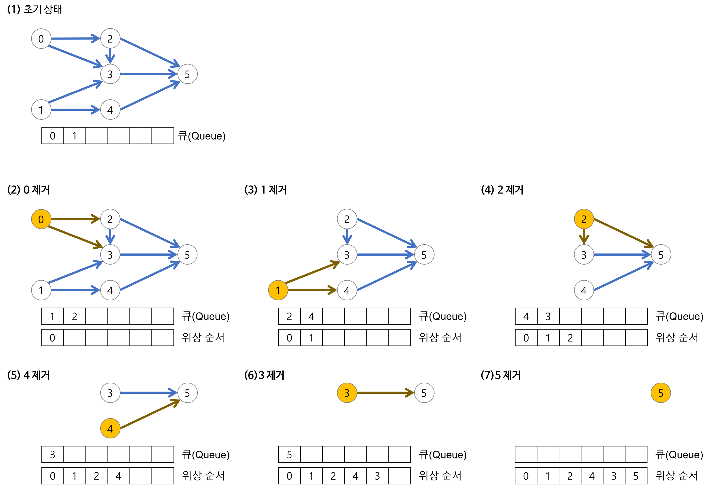

# 위상정렬이란?

- 방향 그래프에서 정점들의 **순서를 나열하는 알고리즘**
- 단, **사이클이 없는 그래프**에서만 동작한다.
- 즉, 어떤 일들을 순서대로 수행해야 할 때
    - 선행작업 → 후행작업의 관계를 고려해 나열하는 것

## 활용 예시

- 강의 수강 순서
    - 선수 과목 → 후수 과목
- 작업 스케줄링
    - 작업 B는 A가 끝난 후에만 시작 가능
- 빌드 시스템
    - 모듈 C는 A와 B가 컴파일된 후 가능

# 알고리즘 흐름

1. 진입 차수가 0인 정점들을 큐에 삽입
2. 큐에서 하나씩 꺼내어 결과 배열에 추가
3. 꺼낸 정점과 연결됨 정점들의 진입 차수를 1씩 감소
4. 새롭게 진입 차수가 0이 된 정점들들 큐에 삽입
5. 큐가 빌 때까지 반복

## 예시



1. 진입 차수 계산
    - 각 노드로 들어오는 간선의 수를 계산 → 진입 차수
    - 진입 차수가 0인 노드만 먼저 처리 가능
    - 초기 큐 상태 : 0 → 결과 리스트 : []
2. 큐에서 0 꺼냄
    - 0번 노드 방문 → 결과 리스트 : [0]
    - 0번 노드가 향하는 노드들의 진입 차수를 각각 -1
    → 1번과 2번의 진입 차수가 감수 → 1은 0이 되므로 큐에 추가
    - 큐 상태 : [1, 2]
3. 큐에서 1 꺼냄
    - 1번 노드 방문 → 결과 리스트 : [0, 1]
    - 1 → 3, 4 향하므로
    → 3번, 4번의 진입 차수가 각각 -1
    → 4는 진입 차수 0 → 큐에 추가
    - 큐 상태 : [2, 4]
4. 큐에서 2 꺼냄
    - 2번 노드 방문 → 결과 리스트 : [0, 1, 2]
    - 2 → 3 향함 → 3진입 차수 -1 → 0 큐에 추가
    - 큐 상태 : [4, 3]
5. 큐에서 4 꺼냄
    - 4번 노드 방문 → 결과 리스트 : [0, 1, 2, 4]
    - 4 → 5 향함 → 5 진입 차수 -1 → 0 큐에 추가
    - 큐 상태 : [3, 5]
6. 큐에서 3 꺼냄
    - 3번 노드 방문 → 결과 리스트 : [0, 1, 2, 4, 3]
    - 3은 더 이상 연결된 노드 없음
    - 큐 상태 : [5]
7. 큐에서 5 꺼냄
    - 5번 노드 방문 → 결과 리스트 : [0, 1, 2, 4, 3, 5]
    - 5는 연결 없음
    - 큐 상태 : [] 
    ⇒ 종료
    

# 예시 코드

```cpp
#include <iostream>
#include <vector>
#include <queue>
#define MAX 10

using namespace std;

int n, inDegree[MAX];         // 정점 수, 각 정점의 진입 차수 저장 배열
vector<int> a[MAX];           // 인접 리스트 (그래프)

void topologySort() {
    int result[MAX];          // 정렬 결과 저장
    queue<int> q;             // 진입 차수 0인 노드 저장 큐

    // 1. 진입 차수가 0인 노드 큐에 삽입
    for(int i = 1; i <= n; i++) {
        if(inDegree[i] == 0) q.push(i);
    }

    // 2. 큐가 빌 때까지 반복
    for(int i = 1; i <= n; i++) {
        if(q.empty()) {
            cout << "사이클 발생!" << endl;
            return;
        }

        int x = q.front(); q.pop();   // 큐에서 하나 꺼냄
        result[i] = x;                // 정렬 결과 저장

        // 3. 연결된 노드들의 진입 차수 감소
        for(int j = 0; j < a[x].size(); j++) {
            int y = a[x][j];
            if(--inDegree[y] == 0) {
                q.push(y);           // 새롭게 진입 차수 0 → 큐에 삽입
            }
        }
    }

    // 결과 출력
    for(int i = 1; i <= n; i++) {
        cout << result[i] << " ";
    }
}
```
