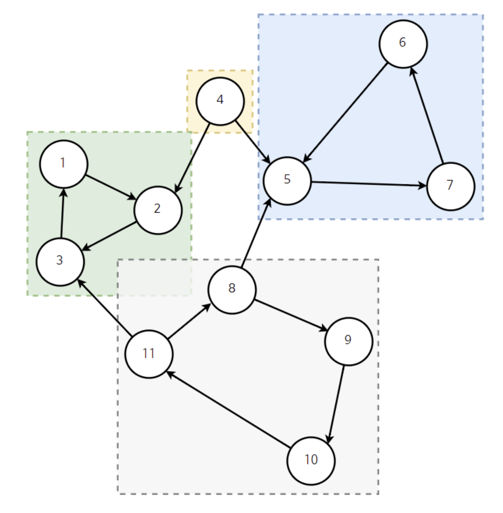
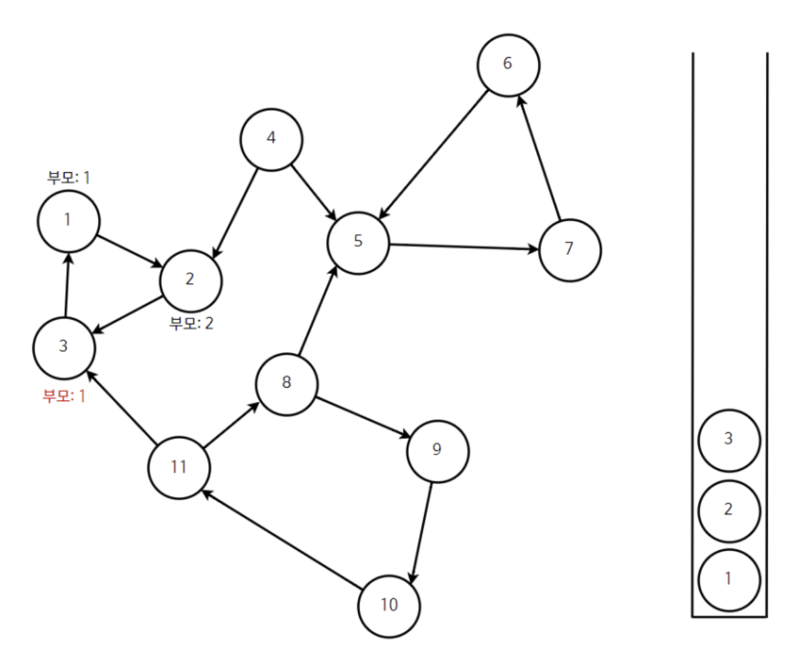
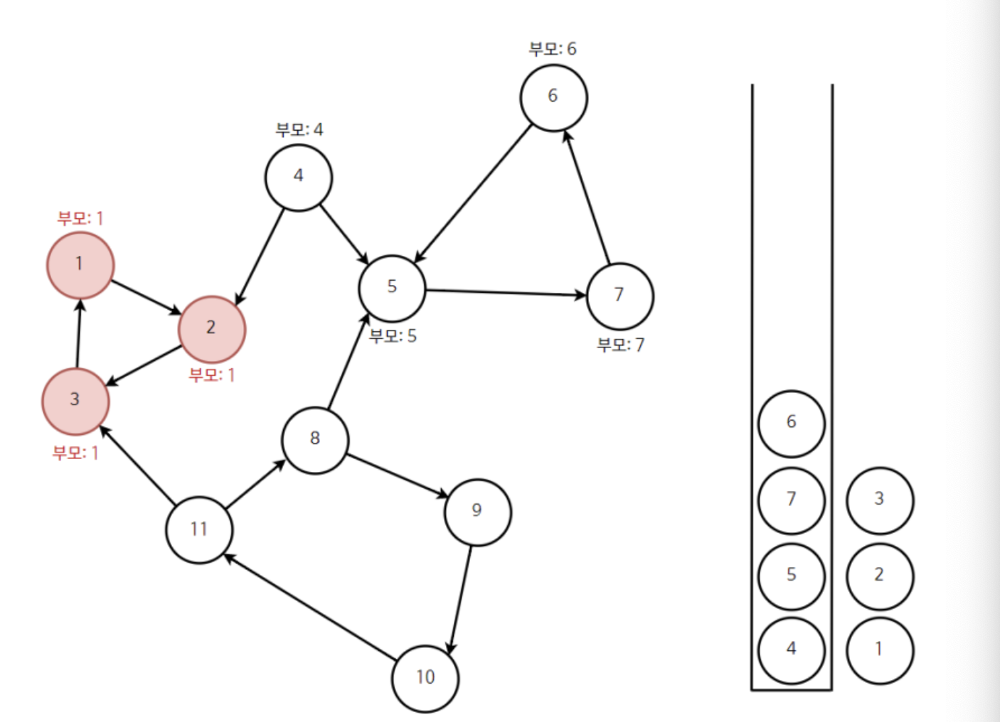
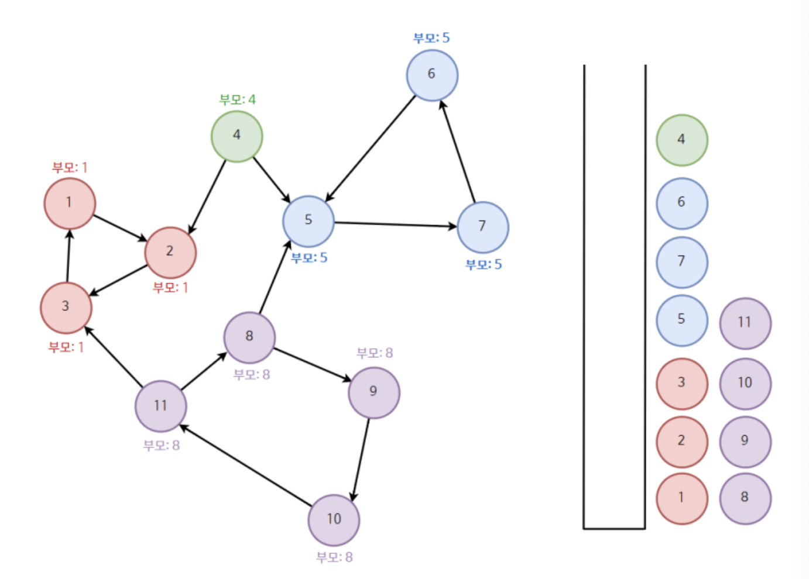

# 강한 결합 요소란

- 그래프 안에서 강하게 결합된 정접 집합 
- 사이클 발생시 강한 결합
- DFS 사용
- 아래 그래프를 보면 특정 부분집합에 속하는 정점끼리
- 서로 어떻게든 도달이 가능한 SCC를 구하면 다음과 같다



# 설명



- 1을 기준으로 방향을 따라 가며 스택에 노드를 쌓는다
- 3에서 부모인 1을 만나면 스택에서 자기자신(1)이 나올 때까지 뽑는다
- 이러면 하나의 SCC 그룹을 발견한 거다

---

- 이 다음에는 4로 간다



- 4,5,7,6이 차례로 스택에 쌓이고
- 다시 5로 가면서 부모가 5가 된다.
- 5를 뺄 때까지 전부 다 빼준다.
- 하나 남은 4는 다른 그룹이 된다.
- 나머지도 이와 똑같은 방식으로 하면 아래처럼 된다.



```cpp
#include <iostream>
#include <vector>
#include <stack>
#include <algorithm>

using namespace std;

const int MAX = 10001;

int V, E; // 노드 수, 간선 수
vector<int> graph[MAX];
int id; // 노드마다 붙일 고유 번호
int d[MAX]; // 노드 방문 순서 저장
bool finished[MAX]; // SCC 처리 여부
vector<vector<int>> SCC;
stack<int> st;

// DFS 함수 (Tarjan’s 핵심)
int dfs(int x) {
    d[x] = ++id;
    st.push(x);

    int parent = d[x];
    for (int i : graph[x]) {
        if (d[i] == 0) { // 방문 안한 이웃
            parent = min(parent, dfs(i));
        }
        else if (!finished[i]) { // 방문은 했는데 아직 SCC 아님
            parent = min(parent, d[i]);
        }
    }

    // 자신이 루트일 경우
    if (parent == d[x]) {
        vector<int> scc;
        while (true) {
            int t = st.top();
            st.pop();
            scc.push_back(t);
            finished[t] = true;
            if (t == x) break;
        }
        sort(scc.begin(), scc.end()); // 번호 순 정렬
        SCC.push_back(scc);
    }

    return parent;
}

int main() {
    ios::sync_with_stdio(false);
    cin.tie(nullptr);

    cin >> V >> E;

    for (int i = 0; i < E; i++) {
        int a, b;
        cin >> a >> b;
        graph[a].push_back(b);
    }

    for (int i = 1; i <= V; i++) {
        if (d[i] == 0) dfs(i);
    }

    cout << "총 SCC 개수: " << SCC.size() << "\n\n";
    int idx = 1;
    for (auto& scc : SCC) {
        cout << "SCC " << idx++ << " : ";
        for (int x : scc) cout << x << " ";
        cout << "-1\n";
    }

    return 0;
}

```
