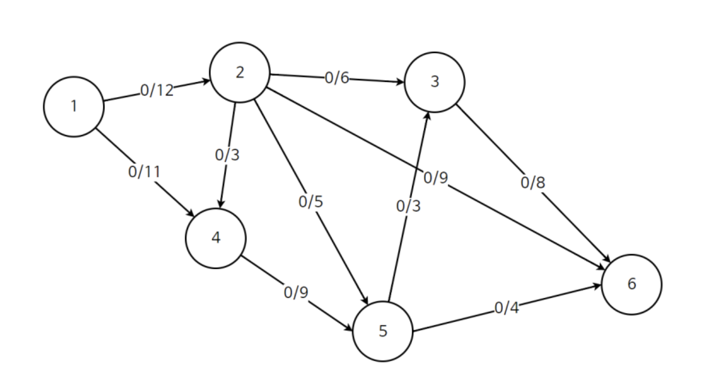

# 네트워크 플로우란?



- 한 지점(소스)에서 다른 지점(싱크)으로 **최대로 얼마나 데이터를 보낼 수 있는지**를 계산하는 문제
- 파이프마다 정해진 물통 용량(capacity)이 있는데, 물을 흘려보내는 최대 양(flow)을 구하는 과정이라고 생각.

### 주요 용어

| 용어 | 설명 |
| --- | --- |
| **용량 (Capacity)** | 간선이나 파이프가 허용하는 최대 유량 |
| **유량 (Flow)** | 현재 흘러가는 실제 유량 |
| **잔여 용량 (Residual Capacity)** | `잔여 용량 = 용량 – 유량` (갈 수 있는 남은 길) |
| **역방향 간선 (Reverse edge)** | 이미 보낸 유량을 **되돌릴 수 있게** 허용하는 구조 (음의 유량 개념) |

### 알고리즘 구조

1. **모든 유량을 0으로 초기화**
2. BFS(너비우선탐색)로 ‘**유량이 더 흐를 수 있는 경로(증가 경로)**’를 찾는다.
3. 경로의 병목 용량(가장 작은 잔여 용량)만큼 유량을 흐르게 하고,
    - 정방향 잔여 용량은 **줄인다.**
    - 역방향 간선은 **늘려서 되돌릴 수 있게**
4. 더 이상 경로가 없을 때까지 2–3 단계 반복 → **최대 유량**

이 과정이 바로 **Edmonds–Karp 알고리즘**이야.

> BFS를 쓰는 이유는 “**간선 수가 가장 적은 경로**”를 매번 찾아주기 때문에, 효율적으로 최대 유량을 찾아준다.
> 
> 
> 시간 복잡도 `O(V × E²)`
> 

### 왜 역방향과 음의 유량이 필요할까?

이미 보낸 유량이 있게 되면, 나중에 그 경로를 일부 **되돌려서 다시 다른 경로로 활용**하는 게 가능해야 한다.

그걸 위해 **역방향 간선**, 즉 ‘음의 흐름’ 개념을 도입하는 것이다.

이렇게 해야 **모든 가능한 경로를 효율적으로 탐색**할 수 있다.

---

### 예시 코드 (Edmonds–Karp 방식)

```cpp
#include <iostream>
using namespace std;

const int MAX = 100;
int n = 6, result = 0;
int cap[MAX][MAX], flow[MAX][MAX], parentArr[MAX];
vector<int> adj[MAX];

void maxFlow(int s, int t) {
    while (1) {
        fill(parentArr, parentArr+MAX, -1);
        queue<int> q;
        q.push(s);
        parentArr[s] = s;

        while (!q.empty() && parentArr[t] == -1) {
            int u = q.front(); q.pop();
            for (int v : adj[u]) {
                if (parentArr[v] == -1 && cap[u][v] - flow[u][v] > 0) {
                    parentArr[v] = u;
                    q.push(v);
                }
            }
        }
        if (parentArr[t] == -1) break;

        int currentFlow = INT_MAX;
        for (int v = t; v != s; v = parentArr[v]) {
            int u = parentArr[v];
            currentFlow = min(currentFlow, cap[u][v] - flow[u][v]);
        }
        for (int v = t; v != s; v = parentArr[v]) {
            int u = parentArr[v];
            flow[u][v] += currentFlow;
            flow[v][u] -= currentFlow;
        }
        result += currentFlow;
    }
}

int main() {
    // 예시 그래프 세팅
    adj[1].push_back(2); adj[2].push_back(1); cap[1][2] = 12;
    adj[1].push_back(4); adj[4].push_back(1); cap[1][4] = 11;
    // ... 나머지 간선도 비슷하게 추가 ...

    maxFlow(1, 6);
    cout << "최대 유량: " << result << "\n";
}

```

---

### 한 줄 요약

> “BFS로 계속 갈 수 있는 길을 찾고, 병목만큼 보내고, 역방향으로 되돌릴 수 있게 한다. 더 갈 길이 없을 때까지 반복하면 최대 유량을 구할 수 있다.”
> 

# Reference

[https://m.blog.naver.com/ndb796/221237111220?recommendTrackingCode=2](https://m.blog.naver.com/ndb796/221237111220?recommendTrackingCode=2)
