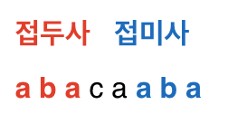

# 개념

- KMP 알고리즘은 접두사와 접미사의 개념을 활용하여
    - 반복되는 연산을 얼마나 줄일 수 있는지 판별하여
    - 매칭할 문자열을 빠르게 점프하는기법
- 일단 접두사와 접미사
    - 앞에 있는 문자열과
    - 뒤에 있는 문자열을 의미
    - 예 )
        
        
        
- 우리가 구해야 할 것은 위와 같은 접두사와 접미사가 일치하는 최대 길이이다


- 위와 같이 접두사와 접미사를 구하면
- 접두사와 접미사가 일치하는 경우에 한해서는 점프(Jump) 가능 ⇒ 효율적

# 코드 1

```cpp
#include <iostream>
#include <vector>

using namespace std;

vector<int> makeTable(string pattern) {
    int patternSize = pattern.size();
    vector<int> table(patternSize, 0);
    int j = 0;
    for (int i = 1; i < patternSize; i++) {
        while (j > 0 && pattern[i] != pattern[j]) {
            j = table[j - 1];
        }
        if (pattern[i] == pattern[j]) {
            table[i] = ++j;
        }
    }
    return table;
}

int main(void) {
    string pattern = "abacaaba";
    vector<int> table = makeTable(pattern);
    for (int i = 0; i < table.size(); i++) {
        printf("%d ", table[i]);
    }
    return 0;
}

```


# 예시 : 최대 일치 길이


---

1. 상황 가정
    - 텍스트 : 긴책  (예: `"ababacabacaabacaaba"`)
    - 패턴 : 찾고 싶은 문장 (예: `"abacaaba"`)
2. 단순 비교 방식이면?
    - 책의 첫 글자부터 패턴 전체를 한 칸씩 계속 대조해봄
    - 틀리면 → 책 한 칸 옮겨서 처음부터 다시 확인
        - 시간 오래 걸림
3. KMP
    
    > 이미 읽은 부분을 또 읽을 필요 없다.
    > 
    - 패턴의 **앞부분(접두사)와 뒷부분(접미사)**이 같은 구간을 미리 계산해둔다.
    - 이것이 `실패 함수`이다
    - 예: `"abacaaba"`의 실패함수는
        
        ```
        a b a c a a b a
        0 0 1 0 1 1 2 3
        ```
        
        → `"aba"` 같은 접두사=접미사 정보가 들어 있음.
        
4. 위의 상황에서
    1. 처음 비교
        - 책과 패턴을 나란히 두고 왼쪽부터 맞춰본다.
        - a b a 까지는 잘 맞다
    2. 불일치 발생
        - 다음 글자가 다름 (c 와 b)
        - 단순 비교라면 책을 한 칸 옮겨야 하지만
        - KMP는 **접두사 = 접미사** 정보를 이용
            
            → 패턴을 **한 번에 여러 칸 점프**시킨다
            
        - 즉, 앞에 있던 ab는 뒤쪽에도 있으니까 그 부분은 다시 확인할 필요 없다.
    3. 점프 후 다시 비교
        - 패턴의 b부터 이어서 다시 대조 시작
        - 이렇게 해서 책을 읽는 횟수가 줄어듦
    4. 끝까지 진행
        - 이런 방식으로 불일치가 나와도
            - 겹치는 접두사 부분만 남기고 바로 다시 비교
        - 결국 “abacaaba”를 책에서 찾아냄
        - 또 겹치는 부분(aba)이 있으므로
        - 이어서 다음 매칭도 바로 찾을 수 있음
5. 정리
    - 퍼즐 조각 맞추기와 비유했을 때
        - 단순 비교 : 매번 조각을 처음부터 다시 맞춤
        - KMP : 이미 맞춘 퍼즐 모양을 기억했다가 
                   안 맞으면 **겹치는 부분만 유지하고 바로 이어서 맞추기 시작**

# 코드 2

```cpp
#include <iostream>
#include <vector>

using namespace std;

// 패턴 문자열로부터 부분 일치 테이블(접두사=접미사 길이 배열)을 생성하는 함수
vector<int> makeTable(string pattern) {
    int patternSize = pattern.size();
    vector<int> table(patternSize, 0); // 부분 일치 테이블 초기화 (모두 0)
    int j = 0; // 접두사와 접미사가 일치한 최대 길이

    for(int i = 1; i < patternSize; i++) { 
        // 현재 문자 pattern[i]와 비교할 접두사 문자 pattern[j]
        
        // 불일치하면 직전까지 일치한 부분으로 돌아감
        while(j > 0 && pattern[i] != pattern[j]) {
            j = table[j - 1];
        }

        // 일치하면 j를 1 증가시키고 그 값을 테이블에 저장
        if(pattern[i] == pattern[j]) {
            table[i] = ++j;
        }
    }
    return table; // 완성된 부분 일치 테이블 반환
}

// KMP 알고리즘으로 parent(본문)에서 pattern(패턴) 찾기
void KMP(string parent, string pattern) {
    vector<int> table = makeTable(pattern); // 부분 일치 테이블 생성
    int parentSize = parent.size();
    int patternSize = pattern.size();
    int j = 0; // 현재 패턴의 인덱스

    // 본문 문자열 순회
    for(int i = 0; i < parentSize; i++) {
        // 불일치 시, 테이블을 이용해 j 이동
        while(j > 0 && parent[i] != pattern[j]) {
            j = table[j - 1];
        }

        // 일치하면 j 증가
        if(parent[i] == pattern[j]) {
            if(j == patternSize - 1) {
                // 패턴 전체가 일치하면 발견!
                printf("%d번째에서 찾았습니다.\n", i - patternSize + 2);
                // 다음 탐색을 위해 j를 테이블 값으로 갱신
                j = table[j];
            } else {
                j++;
            }
        }
    }
}

int main(void) {
    string parent = "ababacabacaabacaaba"; // 본문 문자열
    string pattern = "abacaaba";           // 찾을 패턴 문자열
    
    // KMP 실행
    KMP(parent, pattern);

    return 0;
}

```


# Reference

[https://m.blog.naver.com/ndb796/221240660061?recommendTrackingCode=2](https://m.blog.naver.com/ndb796/221240660061?recommendTrackingCode=2)
