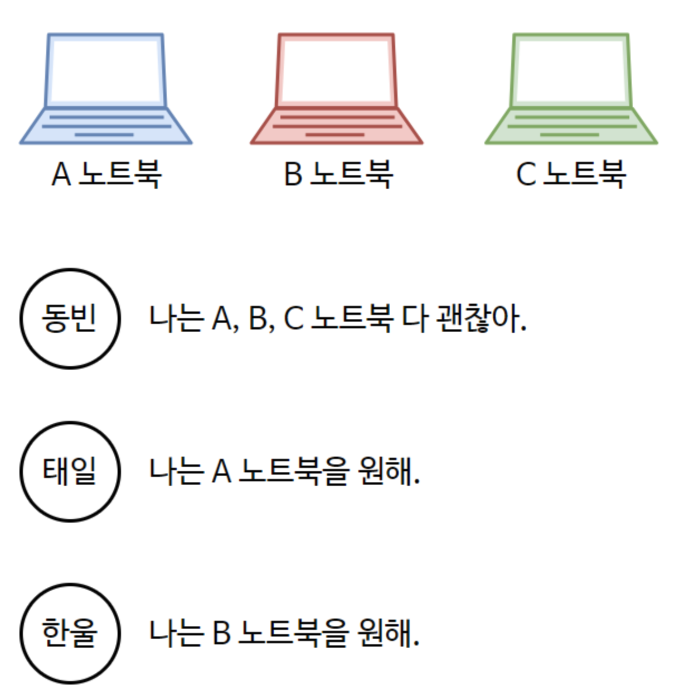
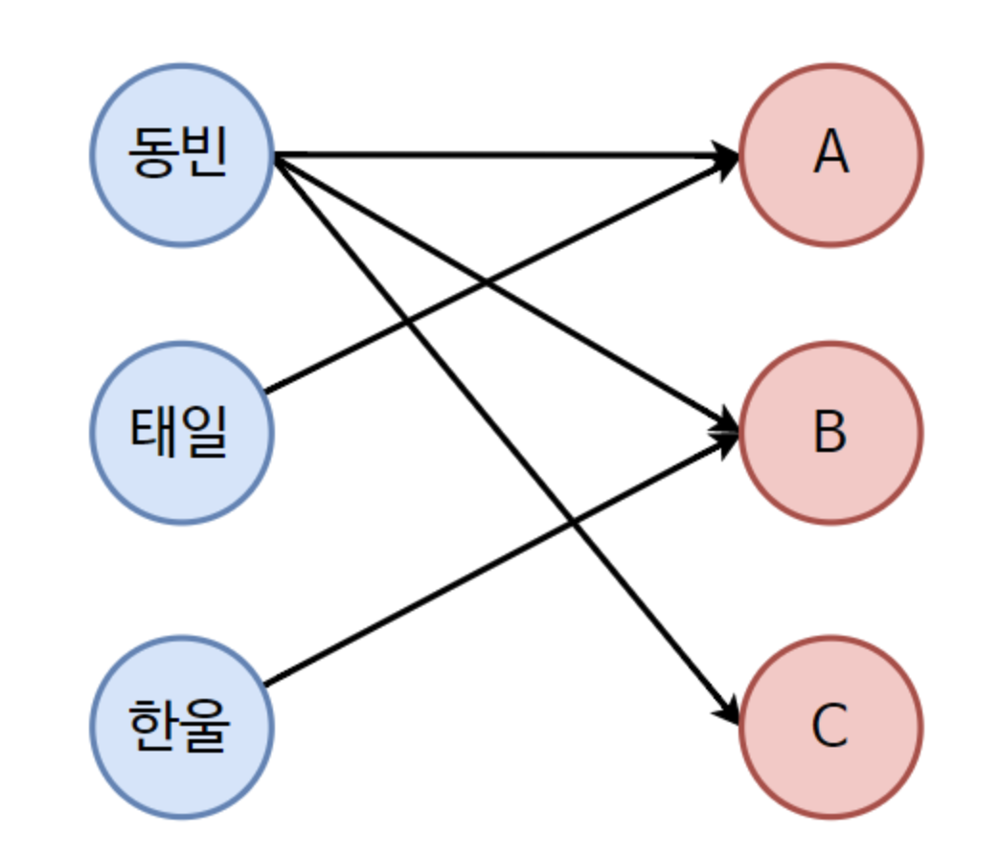
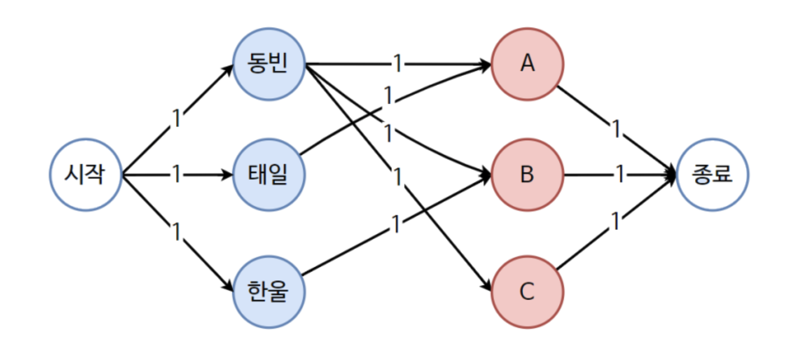
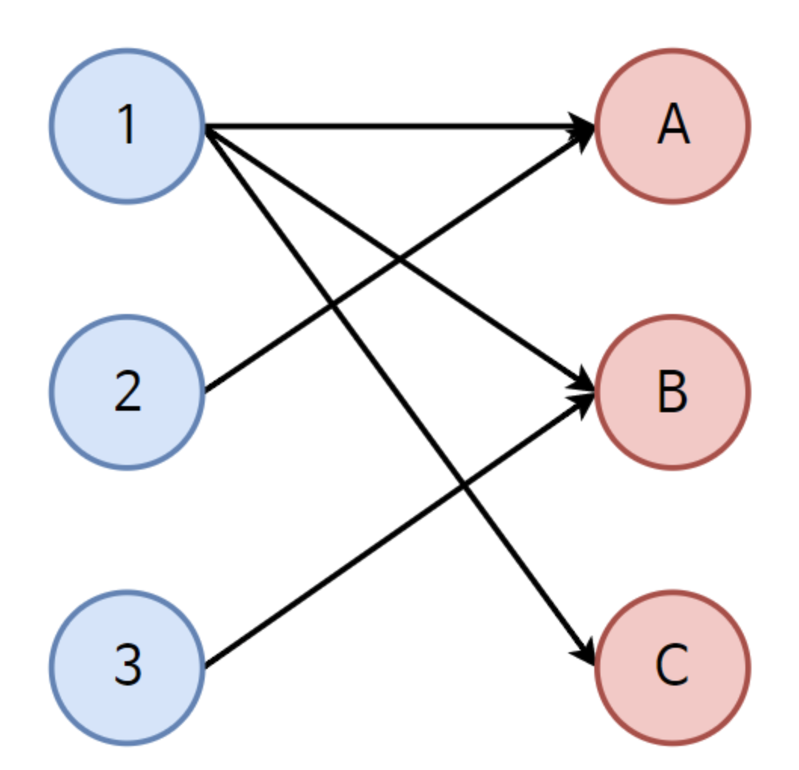
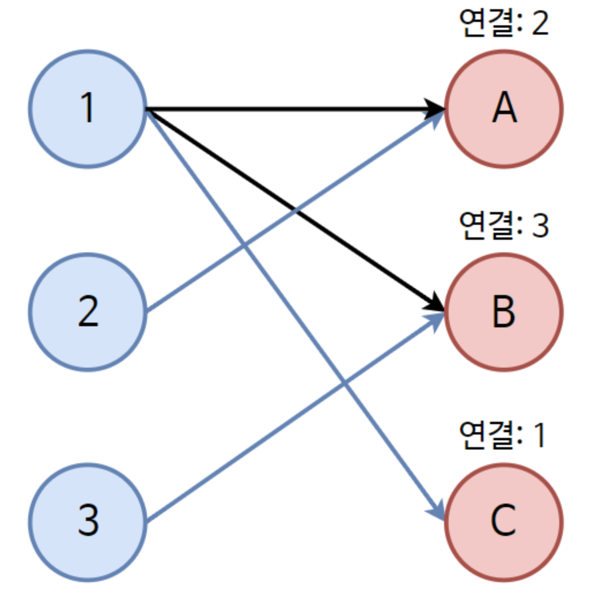

## 1. 이분 그래프란?

- 네트워크 플로우와 연계되는 알고리즘
- 정점 집합이 두 그룹(A 집단, B 집단)으로 나눠져 있고
- 간선은 A 집단과 B 집단을 연결하는 경우에만 존재하는 그래프

---

## 2. 매칭(Matching)

- 매칭이란 간선들을 선택하는 것
    - 선택된 간선끼리는 **정점이 겹치지 않도록** 해야 함
    - 즉, 한 사람은 하나의 노트북만, 한 노트북은 한 사람에게만 연결될 수 있음

---

## 3. 최대 매칭(Maximum Matching)

- 가능한 매칭들 중에서 **간선 수(매칭된 쌍의 수)가 최대인 경우**를 의미
- 문제의 목표 = 사람과 노트북을 최대한 많이 연결

# 4. 예시

- **사람**이라는 집단과 **노트북**이라는 집단이 있다



- 위와 같은 집단이 있을 때 가장 효과적으로 매칭시켜줄 수 있는 경우를 알아보자
    
    ⇒ 그래프를 그려보자
    



- 효과적인 매칭 = 최대 매칭
- 모든 사람 각각이 노트북을 선택하여 가장 많이 연결되는 경우를 찾는 문제
- 위의 그림을 아래와 같은 플로우로 나타내면 네트워크 플로우와 일치하다
    - 즉, 이분 매칭 알고리즘은 네트워크 플로우로 표현할 수 있다.



## 흐름



1. 정점 1과 A가 연결된다.
    - 정점 1번 입장에서는 A가 아무와도 연결되어 있지 않기 때문에 바로 A를 선택
2. 정점 2는 A만 선택할 수 있는데 이미 정점1이 점유를 하고 있다.
    - 이럴 경우 A를 점유하고 있는 1번부터 다시 출발하여
    - A를 제외하고 다른 곳으로 연결될 수 없는지 확인
    - 확인 결과 B와 연결 가능 ⇒ B와 연결
3. 정점 3은 B만 연결할 수 있는데 이미 점유되어 있는 상황
    - B를 점유하고 있는 정점 1에 가서 다른 것을 선택할 수 없는지 확인
    - A는 정점 2번이 선택 중
    - B는 정점 3번이 선택할 예정
    - C만 선택 가능 ⇒ 정점 1을 C와 연결

결과



# 5. 코드

```cpp
#include <iostream>
#include <vector>
#include <algorithm>
#define MAX 101
using namespace std;

// A집단 정점(왼쪽)에서 B집단 정점(오른쪽)으로의 간선을 저장하는 인접 리스트
// a[x] = x번 사람(왼쪽 정점)이 연결 가능한 노트북(오른쪽 정점)들의 목록
vector<int> a[MAX];

// d[y] = 오른쪽 정점 y에 현재 매칭되어 있는 왼쪽 정점 번호 (없으면 0)
int d[MAX];

// c[y] = 이번 DFS에서 오른쪽 정점 y를 방문했는지 여부(증가 경로 탐색용 방문 체크)
bool c[MAX];

// 예시용 정점 개수(왼쪽 정점 수). 오른쪽 정점 수도 예시에 맞춰 3개로 둡니다.
int n = 3;

// 매칭을 한 건이라도 늘릴 수 있으면 true, 못 늘리면 false
// x: 매칭을 시도할 왼쪽 정점(사람)
bool dfs(int x) {
    // x와 연결된 모든 오른쪽 정점(노트북)을 순회
    for (int i = 0; i < (int)a[x].size(); i++) {
        int t = a[x][i];            // t = 오른쪽 정점 번호(노트북)

        if (c[t]) continue;         // 이미 이번 DFS에서 본 오른쪽 정점이면 패스(중복 방지)
        c[t] = true;                // t를 방문 처리

        // case1) t가 아직 비어 있거나
        // case2) t에 매칭되어 있던 왼쪽 정점 d[t]을 다른 곳으로 재배치 가능하면(증가 경로 존재)
        if (d[t] == 0 || dfs(d[t])) {
            d[t] = x;               // 오른쪽 정점 t를 왼쪽 정점 x와 매칭
            return true;            // 매칭 1건 증가 성공
        }
    }
    return false;                   // x로는 더 이상 매칭을 늘릴 수 없음
}

int main() {
    ios::sync_with_stdio(false);
    cin.tie(nullptr);

    // ===== 예시 그래프 구성 =====
    // 사람(왼쪽): 1=동빈, 2=태일, 3=한율
    // 노트북(오른쪽): 1=A, 2=B, 3=C
    a[1].push_back(1);  // 동빈 -> A
    a[1].push_back(2);  // 동빈 -> B
    a[1].push_back(3);  // 동빈 -> C
    a[2].push_back(1);  // 태일 -> A
    a[3].push_back(2);  // 한율 -> B
    // ===========================

    int countMatch = 0;                     // 최종 매칭 수

    // 왼쪽 정점 1..n까지 각각에 대해 증가 경로 탐색
    for (int i = 1; i <= n; i++) {
        fill(c, c + MAX, false);            // 매 왼쪽 정점마다 방문배열 초기화
        if (dfs(i)) countMatch++;           // 증가 경로를 찾으면 매칭 수 +1
    }

    // 결과 출력
    cout << countMatch << "개의 매칭이 이루어졌습니다.\n";

    // 오른쪽 정점(노트북) 기준으로, 누가 매칭되었는지 출력
    // d[y]가 0이 아니면 y는 d[y]와 매칭됨
    for (int y = 1; y <= 100; y++) {
        if (d[y] != 0) {
            cout << d[y] << " -> " << y << "\n";  // (사람) -> (노트북)
        }
    }
    return 0;
}
```

# Reference

[https://m.blog.naver.com/ndb796/221240613074?recommendTrackingCode=2](https://m.blog.naver.com/ndb796/221240613074?recommendTrackingCode=2)
