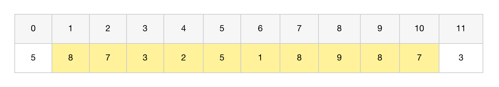
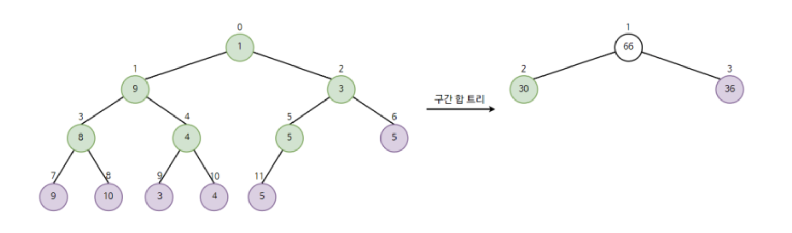
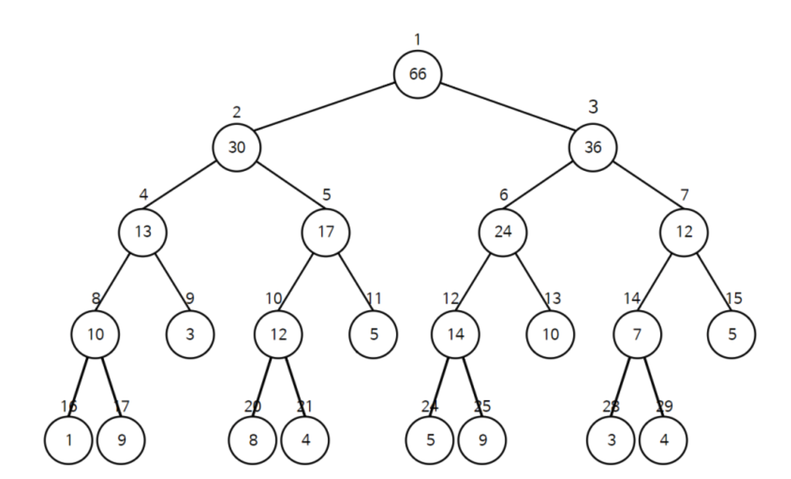
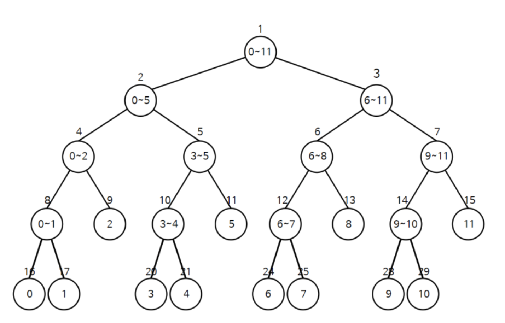
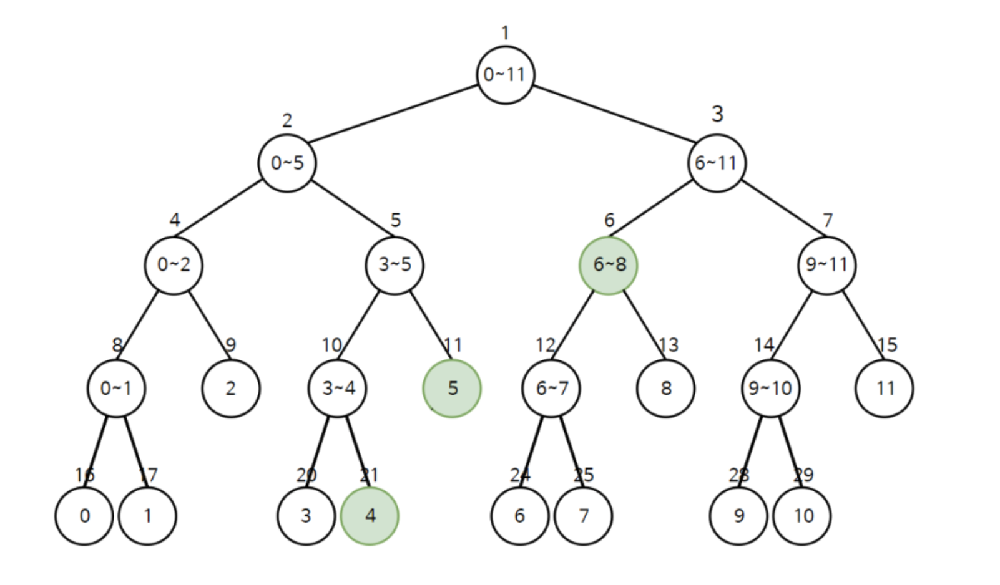
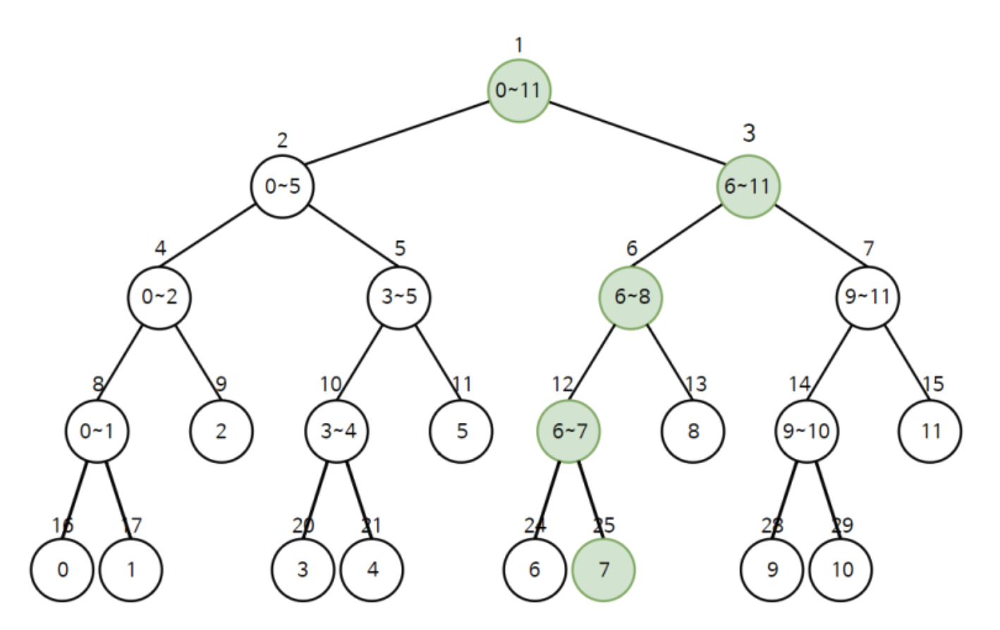
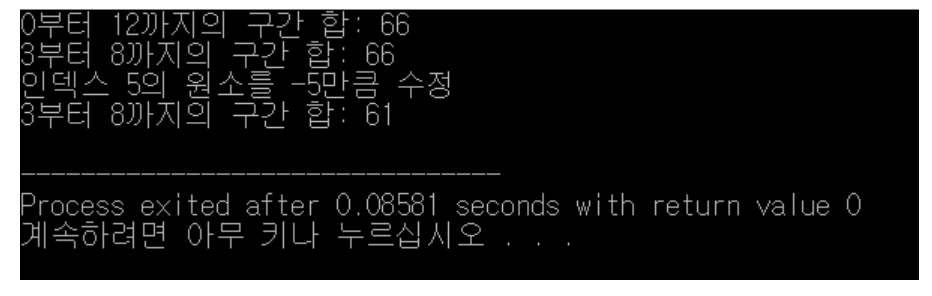

# 개념

- 세그먼트 트리는 여러 개의 데이터가 연속적으로 존재할 때
    - 특정한 범위의 데이터의 합을 구하는 방법에 관한 것임
- 데이터의 합을 가장 빠르고 간단하게 구할 수 있는 자료구조

# 예시

> 배열에서 특정 구간의 합을 가장 빠르게 구하는 방법은 무엇일까
예시 데이터 : 5 8 7 3 2 5 1 8 9 8 7 3
> 

위와 같은 12개의 데이터가 있다고 가정

## 방법 1

- 단순 배열을 이용해 선형적으로 구하기



- 위와 같이 배열에 담는다
- 만약 인덱스 1~10의 수를 모두 더하려면 어떻게 해야 할까?
- 그냥 다 더하면 된다
- 이렇게 할 경우 시간복잡도가 `O(N)`이 나온다.

## 방법 2

- 하지만 **세그먼트 트리**를 이용한다면
- 시간복잡도는 `O(logN)`이 나온다.
- 어떻게 하면 세그먼트 트리를 이용할 수 있을까

### 구간 합 트리 생성하기

- 배열을 트리 형식으로 나타내면 왼쪽 트리와 같다
- 구간 합 트리의 최상단에는 전체 원소를 더한 값이 들어간다.
- 2번째 노드는 인덱스 0 ~ 5까지의 원소를 더한 값을
- 3번째 노드는 인덱스 6~11까지의 원소를 더한 값이 들어간다.
- 즉, 원래 데이터의 범위를 반씩 분할하여
    - 그 구간의 합들을 저장하도록 초기 설정하는 것이다
    - 



---

- 이러한 과정을 반복하면 아래와 같은 구간 합 트리의 전체 노드를 그릴 수 있다.
- 구간 합 트리에 한해서는 **인덱스 번호가 1부터 시작**한다.
- 그 이유는
    - 구간 합 트리는 1부터 시작하면
    - 2를 곱했을 때 왼쪽 자식 노드를 가리키므로 효과적이기 때문



- 구간 합 트리는 반복적으로 구현하는 것보다 재귀적으로 구현하는 것이 더 간단하다.

```cpp
#include <iostream>
#include <vector>
using namespace std;

// 전역 변수 (예시용)
vector<int> a;       // 원본 배열
vector<int> tree;    // 세그먼트 트리 배열

// 세그먼트 트리 초기화 함수
// start : 구간 시작 인덱스
// end   : 구간 끝 인덱스
// node  : 현재 트리 노드 번호 (루트는 1번 노드)
int init(int start, int end, int node) {
    // 구간이 한 원소로만 이루어져 있다면 (리프 노드)
    if (start == end) 
        return tree[node] = a[start]; 

    // 중간 지점 계산
    int mid = (start + end) / 2;

    // 왼쪽 자식과 오른쪽 자식을 재귀적으로 초기화한 뒤
    // 두 값을 합쳐 현재 노드 값을 저장
    return tree[node] = init(start, mid, node * 2) 
                      + init(mid + 1, end, node * 2 + 1);
}

int main() {
    ios::sync_with_stdio(false);
    cin.tie(0);

    // 예시: 크기 8짜리 배열
    a = {0, 5, 8, 6, 3, 2, 7, 2, 6};  
    // 인덱스 편의를 위해 0번은 사용하지 않고 1번부터 시작 (a[1]~a[8])

    int n = a.size() - 1; // 실제 원소 개수 (8개)

    // 세그먼트 트리 크기 : 보통 4배 정도 할당
    tree.resize(n * 4);

    // 세그먼트 트리 초기화 (루트노드는 1번)
    init(1, n, 1);

    // 결과 출력 (트리 배열 상태 확인용)
    cout << "세그먼트 트리: ";
    for (int i = 1; i < 2 * n; i++) cout << tree[i] << " ";
    cout << "\n";

    return 0;
}
```

- 구간 합 트리는 다음과 같이 매 노드가 이미 구간의 합을 가지고 있는 형태가 된다.
- 노드의 인덱스와 구간의 합은 별개의 값이므로 헷갈리지 않게 주의한다.

---



- 구간 합 트리의 원소 개수는
- 데이터의 개수가 N개일 때 N보다 큰 가장 가가운 N의 제곱수를 구한 뒤
- 그것의 2개까지 미리 배열의 크기를 만들어 놓아야 한다.
    - 위의 경우 데이터가 12개이므로
    - 16 * 2 = 32개의 크기가 필요하다.

### 구간 합을 구하는 함수 만들기

- 예를 들어 4 ~ 8의 범위에 대한 합을 구해보자.
- 그러려면 아래와 같이 세 노드의 합만 구해주면 된다.



- 아까 구간 합 트리에서 인덱스 6 원소값은 24
    - 인덱스 11의 원소 값은 5
    - 인덱스 21의 원소 값은 4였다.
- 따라서 이 경우에 구하고자 하는 답은 24 + 5 + 4 = 33이다
- 재귀를 이용해 구현하면 간단하게 구현 가능하다

```cpp
// start: 시작 인덱스, end: 끝 인덱스
// left, right: 구간 합을 구하고자 하는 범위
int sum(int start, int end, int node, int left, int right) {
    // 범위 밖에 있는 경우
    if(left > end || right < start) return 0;

    // 범위 안에 있는 경우
    if(left <= start && end <= right) return tree[node];

    // 그렇지 않다면 두 부분으로 나누어 합을 구하기
    int mid = (start + end) / 2;
    return sum(start, mid, node * 2, left, right) 
         + sum(mid + 1, end, node * 2 + 1, left, right);
}

```

### 특정 원소의 값을 수정하는 함수 만들기

- 특정 원소의 값을 수정할 때는
- 해당 원소를 포함하고 있는 모든 구간 합 노드들을 갱신해주면 된다.
- 이 함수 또한 재귀로 구현



```cpp
// start: 시작 인덱스, end: 끝 인덱스
// index: 구간 합을 수정하고자 하는 노드
// dif: 수정할 값
void update(int start, int end, int node, int index, int dif) {
    // 범위 밖에 있는 경우
    if(index < start || index > end) return;

    // 범위 안에 있으면 내려가며 다른 원소도 갱신
    tree[node] += dif;
    if (start == end) return;

    int mid = (start + end) / 2;
    update(start, mid, node * 2, index, dif);
    update(mid + 1, end, node * 2 + 1, index, dif);
}
```

# 전체 코드

```cpp
#include <iostream>
#include <vector>
#define NUMBER 12

using namespace std;

int a[] = {1, 9, 3, 8, 4, 5, 5, 9, 10, 3, 4, 5};
int tree[4 * NUMBER]; // 4를 곱하면 모든 범위를 커버할 수 있음. 캐시에 대해서 2의 제곱 형태의 길이를 가지기 때문임.

// start: 시작 인덱스, end: 끝 인덱스
int init(int start, int end, int node) {
    if(start == end) return tree[node] = a[start];
    int mid = (start + end) / 2;
    // 재귀적으로 두 부분으로 나눈 뒤 그 합을 자기 자신으로 합니다.
    return tree[node] = init(start, mid, node * 2) + init(mid + 1, end, node * 2 + 1);
}

// start: 시작 인덱스, end: 끝 인덱스
// left, right: 구간 합을 구하고자 하는 범위
int sum(int start, int end, int node, int left, int right) {
    // 범위 밖에 있는 경우
    if(left > end || right < start) return 0;
    // 범위 안에 있는 경우
    if(left <= start && end <= right) return tree[node];
    // 그렇지 않다면 두 부분으로 나누어 합을 구하기
    int mid = (start + end) / 2;
    return sum(start, mid, node * 2, left, right) + sum(mid + 1, end, node * 2 + 1, left, right);
}

// start: 시작 인덱스, end: 끝 인덱스
// index: 구간 합을 수정하고자 하는 노드
// dif: 수정할 값
void update(int start, int end, int node, int index, int dif) {
    // 범위 밖에 있는 경우
    if(index < start || index > end) return;
    // 범위 안에 있으면 내려가며 다른 원소도 갱신
    tree[node] += dif;
    if (start == end) return;
    int mid = (start + end) / 2;
    update(start, mid, node * 2, index, dif);
    update(mid + 1, end, node * 2 + 1, index, dif);
}

int main(void) {
    // 구간 합 트리의 인덱스를 제외하고는 모두 인덱스 0부터 시작합니다.
    // 구간 합 트리 생성하기
    init(0, NUMBER - 1, 1);
    // 구간 합 구하기
    cout << "0부터 12까지의 구간 합: " << sum(0, NUMBER - 1, 1, 0, 12) << '\n';
    // 구간 합 구하기
    cout << "3부터 8까지의 구간 합: " << sum(0, NUMBER - 1, 1, 0, 12) << '\n';
    // 구간 합 갱신하기
    cout << "인덱스 5의 원소를 -5만큼 수정" << '\n';
    update(0, NUMBER - 1, 1, 5, -5);
    // 구간 합 다시 구하기
    cout << "3부터 8까지의 구간 합: " << sum(0, NUMBER - 1, 1, 0, 12) << '\n';
}

```



# Reference

[https://m.blog.naver.com/ndb796/221282210534?recommendTrackingCode=2](https://m.blog.naver.com/ndb796/221282210534?recommendTrackingCode=2)
