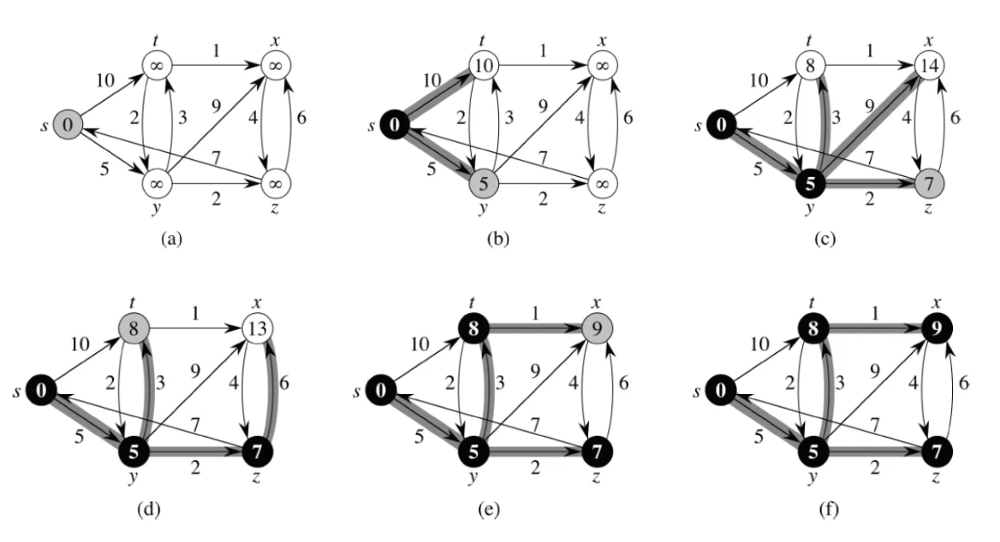
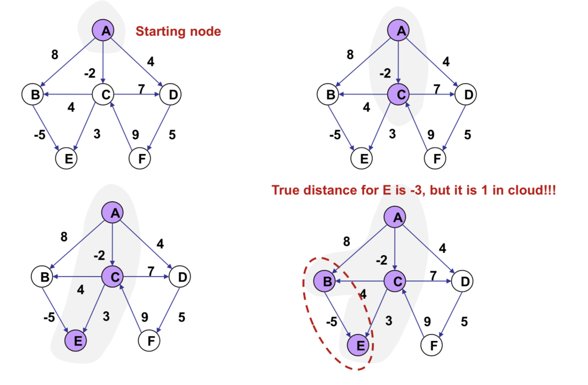

# 다익스트라 (Dijkstra)

카테고리: 알고리즘

# 다익스트라 알고리즘이란?

- 그래프에서 하나의 시작 노드로부터 모든 노드까지의 **최단 거리(Shortest Path)**를 구하는 알고리즘
- 간선의 가중치가 **음수가 아니여야** 정확하게 동작함
- BFS 기반의 우선순위 큐 사용

# 동작 설명

1. a → b
    - s 노드를 기준으로 이웃노드 `t, y`의 거리 업데이트
    - s는 탐색 완료 → 검정색으로 표시
    - 현재 거리 최소 노드인 y를 회색 처리하며 다음 BFS 대상 지정
2. c
    - y 의 이웃 t, x, z에 대해 거리 갱신
    - 예 : `s → y = 5`, `y → t = 3` 에서 `s → t = 8` 로 갱신됨
    - 가장 짧은 거리 노드 z를 다음 대상으로 지정
3. d
    - z의 이웃노드 x에 대해 거리 업데이트
    - `s → z = 7`, `z → x = 6` 에서 `s → x = 13`으로 갱신
4. e
    - t의 이웃 x를 통해 거리 다시 갱신
    - `s → t = 8`, `t → x = 1`에서 `s → x = 9` 갱신 (기존 13부다 작음)
    - 거리 9인 x가 다음 대상
5. f
    - x는 이미 인접 노드 z를 방문했기 때문에 업데이트 없음
    - 모둔 노드 방문 완료 → 알고리즘 종료



# 단점

- 가중치가 음수일 경우 정확한 최단 거리를 보장하지 못한다.
- 전체 간선에 `음수 보정`(절대값 더했다 빼기) 후 계산
- 혹은 `밸만-포드` 알고리즘을 사용하면 음수 가중치도 정확하게 탐색할 수 있다.



# 예시 코드

```cpp
#include <iostream>
#include <vector>
#include <queue>
#include <climits>

using namespace std;

const int INF = INT_MAX;

int main() {
    int V = 5; // 정점 수: 0~4
    vector<vector<pair<int, int>>> graph(V);

    // 간선 정보 입력 (from → to, weight)
    graph[0].push_back({1, 10}); // s → t
    graph[0].push_back({2, 5});  // s → y
    graph[2].push_back({1, 3});  // y → t
    graph[2].push_back({3, 9});  // y → x
    graph[2].push_back({4, 2});  // y → z
    graph[1].push_back({3, 1});  // t → x
    graph[3].push_back({4, 4});  // x → z 
    graph[4].push_back({0, 7});  // z → s
    graph[4].push_back({3, 6});  // z → x 

    vector<int> dist(V, INF);
    dist[0] = 0; // 시작점 s(0)

    priority_queue<pair<int, int>, vector<pair<int, int>>, greater<>> pq;
    pq.push({0, 0}); // {거리, 노드}

    while (!pq.empty()) {
        int cost = pq.top().first;
        int here = pq.top().second;
        pq.pop();

        if (dist[here] < cost) continue;

        for (auto& edge : graph[here]) {
            int there = edge.first;
            int nextCost = cost + edge.second;

            if (nextCost < dist[there]) {
                dist[there] = nextCost;
                pq.push({nextCost, there});
            }
        }
    }

    vector<string> nodeNames = {"s", "t", "y", "x", "z"};
    for (int i = 0; i < V; i++) {
        cout << "s → " << nodeNames[i] << " 최소 거리: ";
        if (dist[i] == INF) cout << "도달 불가\n";
        else cout << dist[i] << "\n";
    }

    return 0;
}

//결과
s → s 최소 거리: 0
s → t 최소 거리: 8
s → y 최소 거리: 5
s → x 최소 거리: 9
s → z 최소 거리: 7
```
# Reference
[https://ratsgo.github.io/data%20structure&algorithm/2017/11/26/dijkstra/](https://ratsgo.github.io/data%20structure&algorithm/2017/11/26/dijkstra/)