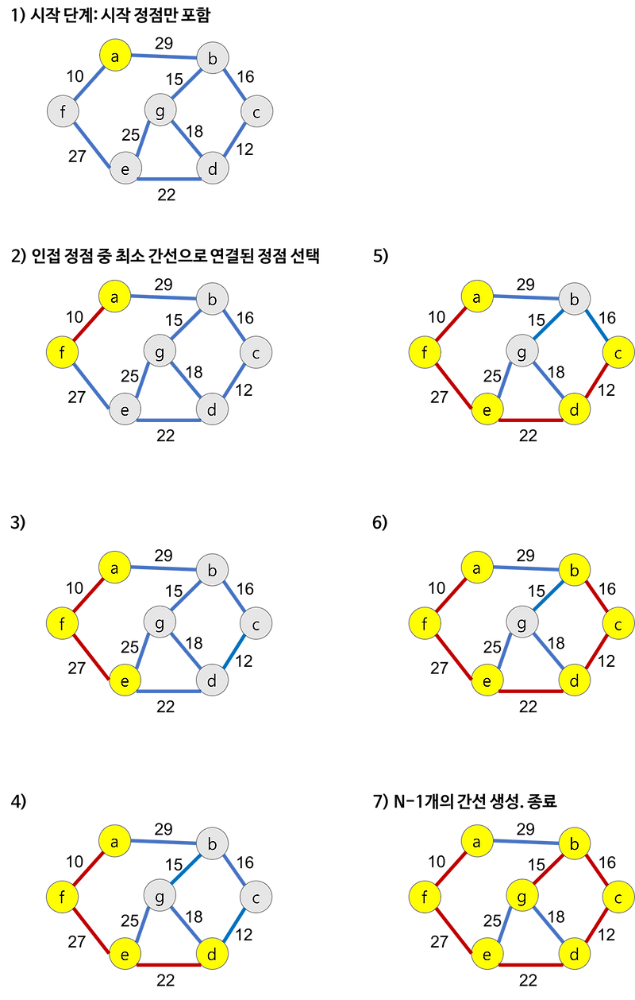

# BFS와 DFS

| 항목 | BFS (Breadth-First Search) | DFS (Depth-First Search) |
| --- | --- | --- |
| 탐색 방향 | **가까운 노드부터** 탐색 | **깊은 노드부터** 탐색 |
| 자료구조 | **Queue** (FIFO) 사용 | **Stack** (재귀 or 명시적 Stack) 사용 |
| 경로 찾기 | 최단 경로 보장 (가중치 없을 때) | 최단 경로 보장 X |
| 재귀 사용 | X | 재귀 또는 명시적 스택 |
| 메모리 사용 | 보통 더 많음 (넓게 퍼짐) | 보통 더 적음 (깊게 탐색) |
| 사용 예시 | 최단 거리, 레벨 탐색 | 미로 탐색, 백트래킹 |


# 구현

## C++

```cpp
#include <iostream>
#include <queue>
#include <stack>
#include <unordered_map>
#include <vector>
#include <set>

using namespace std;

// 그래프: 문자 노드 연결
unordered_map<char, vector<char>> graph = {
    {'A', {'B', 'C'}},
    {'B', {'D', 'E'}},
    {'C', {'F'}},
    {'D', {}},
    {'E', {}},
    {'F', {}}
};

void bfs(char start) {
    queue<char> q;
    set<char> visited;

    q.push(start);

    while (!q.empty()) {
        char node = q.front(); q.pop();

        if (visited.count(node)) continue;

        cout << node << ' ';
        visited.insert(node);

        for (char neighbor : graph[node]) {
            q.push(neighbor);
        }
    }
}

void dfs(char start) {
    stack<char> s;
    set<char> visited;

    s.push(start);

    while (!s.empty()) {
        char node = s.top(); s.pop();

        if (visited.count(node)) continue;

        cout << node << ' ';
        visited.insert(node);

        // 역순으로 push해야 DFS 순서 유지됨
        for (auto it = graph[node].rbegin(); it != graph[node].rend(); ++it) {
            s.push(*it);
        }
    }
}

int main() {
    cout << "[BFS] ";
    bfs('A'); // A B C D E F
    cout << endl;

    cout << "[DFS] ";
    dfs('A'); // A B D E C F
    cout << endl;

    return 0;
}

```

## JAVA

```java
import java.util.*;

public class GraphSearch {
    static Map<Character, List<Character>> graph = new HashMap<>();

    public static void main(String[] args) {
        graph.put('A', Arrays.asList('B', 'C'));
        graph.put('B', Arrays.asList('D', 'E'));
        graph.put('C', Arrays.asList('F'));
        graph.put('D', new ArrayList<>());
        graph.put('E', new ArrayList<>());
        graph.put('F', new ArrayList<>());

        System.out.print("[BFS] ");
        bfs('A'); // A B C D E F
        System.out.println();

        System.out.print("[DFS] ");
        dfs('A'); // A B D E C F
        System.out.println();
    }

    public static void bfs(char start) {
        Queue<Character> queue = new LinkedList<>();
        Set<Character> visited = new HashSet<>();

        queue.add(start);

        while (!queue.isEmpty()) {
            char node = queue.poll();

            if (visited.contains(node)) continue;

            System.out.print(node + " ");
            visited.add(node);

            for (char neighbor : graph.get(node)) {
                queue.add(neighbor);
            }
        }
    }

    public static void dfs(char start) {
        Stack<Character> stack = new Stack<>();
        Set<Character> visited = new HashSet<>();

        stack.push(start);

        while (!stack.isEmpty()) {
            char node = stack.pop();

            if (visited.contains(node)) continue;

            System.out.print(node + " ");
            visited.add(node);

            List<Character> neighbors = graph.get(node);
            // 역순 push: DFS 순서 유지
            for (int i = neighbors.size() - 1; i >= 0; i--) {
                stack.push(neighbors.get(i));
            }
        }
    }
}

```
# Union-Find(Disjoint Set Union, DSU, 합집합)

> 여러 개의 노드가 있을 때, 어떤 노드들이 같은 그룹(집합)에 속해 있는지 빠르게 판별
> 
> 
> 서로 다른 두 그룹을 **하나의 그룹으로 합칠 수 있는 자료구조**
> 
- MST (최소 신장 트리, Kruskal 알고리즘)에 사용


- 0 단계 : 각 원소가 자기 자신을 루트로 가짐 (대표노드 = 자기 자신)
- 1단계 : Union(1, 2)
    - 1의 루트 : 1
    - 2의 루트 : 2
    - 서로 다르니 2를 1에 붙인다 → **1이 대표 루트**
- 2단계 : Union(3, 5)
    - 3의 루트 : 3
    - 5의 루트 : 5
    - 5를 3에 붙인다 → **3이 대표 루트**
- 3단계 : Union(1, 4)
    - 1의 루트 : 1
    - 4의 루트 : 4
    - 4를 1에 붙임 → **1이 대표**
- 4단계 : Find(x) 결과
    
    
    | 노드 | 루트(대표) |
    | --- | --- |
    | 1 | 1 |
    | 2 | 1 |
    | 4 | 1 |
    | 3 | 3 |
    | 5 | 3 |
    | 6 | 6 |
- 5단계 : Union(1, 5)
    - 1의 루트 : 1
    - 5의 루트 : 3
        
        → 서로 다른 그룹이므로 합침 → 보통은 **숫자가 작은 쪽**을 루트로 잡는다.
        
        → 여기선 **3을 1 밑에 붙임**
        

## 예시 코드

```java
public class UnionFind {
    private int[] parent;

    // 생성자: 초기화
    public UnionFind(int size) {
        parent = new int[size + 1]; // 보통 1번부터 사용하니까 size+1
        for (int i = 1; i <= size; i++) {
            parent[i] = i; // 자기 자신이 루트
        }
    }

    // find: 루트 노드 찾기 + 경로 압축
    public int find(int x) {
        if (parent[x] != x) {
            parent[x] = find(parent[x]); // 경로 압축
        }
        return parent[x];
    }

    // union: 두 집합 합치기
    public void union(int a, int b) {
        int rootA = find(a);
        int rootB = find(b);

        if (rootA != rootB) {
            // 작은 루트를 기준으로 합침 (선택적)
            if (rootA < rootB) {
                parent[rootB] = rootA;
            } else {
                parent[rootA] = rootB;
            }
        }
    }

    // 같은 집합인지 확인
    public boolean isConnected(int a, int b) {
        return find(a) == find(b);
    }

    // 상태 출력 (디버깅용)
    public void printParent() {
        System.out.print("Parent Array: ");
        for (int i = 1; i < parent.length; i++) {
            System.out.print(parent[i] + " ");
        }
        System.out.println();
    }

    // 테스트
    public static void main(String[] args) {
        UnionFind uf = new UnionFind(6); // 1~6번 노드

        uf.union(1, 2);
        uf.union(3, 5);
        uf.union(1, 4);

        uf.printParent(); // 상태 확인

        System.out.println("Find(2): " + uf.find(2)); // 루트: 1
        System.out.println("Find(5): " + uf.find(5)); // 루트: 3

        uf.union(1, 5); // 1번 집합과 3번 집합 연결

        uf.printParent(); // 최종 상태
        System.out.println("Find(5): " + uf.find(5)); // 루트: 1
    }
}

```

# 크루스칼 알고리즘

> 모든 노드를 최소 비용으로 연결하는 트리(최소 신장 트리, MST)를 만드는 알고리즘
> 
> 
> 간선 중심(Greedy)으로 하나씩 연결하면서, **사이클이 생기지 않도록** 연결
> 
> ⇒ 간선을 정렬며 하나씩 연결하고 유니온 파인드로 사이클만 피하면 되는 최소 비용 연결 알고리즘
> 
- 그래프의 모든 노드를 **최소 비용**으로 연결(MST)
- 간선(edge)중심 + Greedy 방식
- 유니온-파인드(Disjoint Set)로 **사이클** 방지
- 모든 간선을 **가중치** 기준으로 오름차순 정렬

## 작동 순서

> `사이클`을 방지하기 위해서 유니온파인드를 사용한다.
find(x)로 루트노드를 찾고
union(a, b)로 두 노드를 같은 집합으로 합친다.
만약 이미 같은 집합이면 사이클이 생기니 Pass한다.
> 
1. 모든 간선을 가중치 기준으로 오름차순 정렬
2. 가중치가 가장 낮은 간선부터 선택
3. 선택한 간선이 **사이클**을 만들지 않는다면 연결
    - Union-Find 알고리즘 사용
4. 사이클 생기면 건너뜀
5. N개의 노드에 대해 N -1 개의 간선이 선택되면 종료



## 예시코드

```java
import java.util.*;

class Edge implements Comparable<Edge> {
    int from;
    int to;
    int weight;

    public Edge(int from, int to, int weight) {
        this.from = from;
        this.to = to;
        this.weight = weight;
    }

    // 간선 정렬 기준: 가중치 오름차순
    @Override
    public int compareTo(Edge other) {
        return this.weight - other.weight;
    }
}

class UnionFind {
    private int[] parent;

    public UnionFind(int size) {
        parent = new int[size + 1]; // 노드 번호가 1번부터 시작한다고 가정
        for (int i = 1; i <= size; i++) {
            parent[i] = i;
        }
    }

    public int find(int x) {
        if (parent[x] != x) parent[x] = find(parent[x]);
        return parent[x];
    }

    public void union(int a, int b) {
        int rootA = find(a);
        int rootB = find(b);

        if (rootA != rootB) {
            parent[rootB] = rootA;
        }
    }

    public boolean isConnected(int a, int b) {
        return find(a) == find(b);
    }
}

public class KruskalMST {
    public static void main(String[] args) {
        int V = 7; // 정점 개수 (a~g -> 7개)
        List<Edge> edges = new ArrayList<>();

        // 간선 추가 (노드 번호는 a=1, b=2, ..., g=7로 매핑한다고 가정)
        edges.add(new Edge(1, 6, 1)); // af
        edges.add(new Edge(6, 5, 2)); // fe
        edges.add(new Edge(5, 4, 3)); // ed
        edges.add(new Edge(4, 3, 4)); // dc
        edges.add(new Edge(3, 2, 5)); // cb
        edges.add(new Edge(2, 7, 6)); // bg
        edges.add(new Edge(7, 5, 7)); // ge
        edges.add(new Edge(7, 4, 8)); // gd
        edges.add(new Edge(1, 2, 9)); // ab

        Collections.sort(edges); // 가중치 기준 정렬

        UnionFind uf = new UnionFind(V);
        int totalCost = 0;
        List<Edge> mst = new ArrayList<>();

        for (Edge edge : edges) {
            if (!uf.isConnected(edge.from, edge.to)) {
                uf.union(edge.from, edge.to);
                totalCost += edge.weight;
                mst.add(edge);
            }
        }

        // 출력
        for (Edge edge : mst) {
            System.out.println("노드 " + edge.from + " - 노드 " + edge.to + " (가중치: " + edge.weight + ")");
        }
        System.out.println("총 비용: " + totalCost);
    }
}

// 결과 예시
노드 1 - 노드 6 (가중치: 1)
노드 6 - 노드 5 (가중치: 2)
노드 5 - 노드 4 (가중치: 3)
노드 4 - 노드 3 (가중치: 4)
노드 3 - 노드 2 (가중치: 5)
노드 2 - 노드 7 (가중치: 6)
총 비용: 21

```

# Reference

[https://m.blog.naver.com/ndb796/221230967614?recommendTrackingCode=2](https://m.blog.naver.com/ndb796/221230967614?recommendTrackingCode=2)

[https://velog.io/@jinh2352/유니온-파인드-기초-이코테](https://velog.io/@jinh2352/%EC%9C%A0%EB%8B%88%EC%98%A8-%ED%8C%8C%EC%9D%B8%EB%93%9C-%EA%B8%B0%EC%B4%88-%EC%9D%B4%EC%BD%94%ED%85%8C)

[https://m.blog.naver.com/ndb796/221230994142?recommendTrackingCode=2](https://m.blog.naver.com/ndb796/221230994142?recommendTrackingCode=2)`
