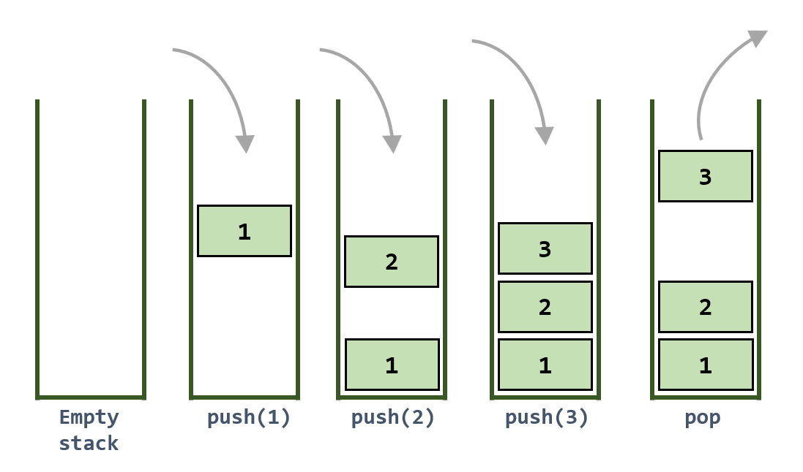
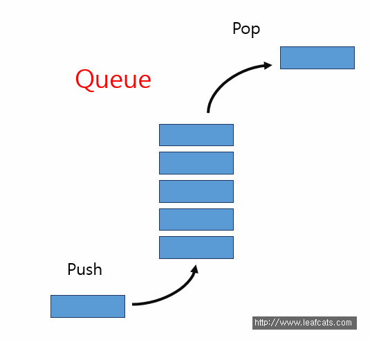

# 스택 (Stack)

- LIFO ( Last In First Out )



- C++ STL을 이용한 Stack 구현

```cpp
#include <iostream>
#include <stack>  // stack 사용을 위한 헤더

using namespace std;

int main() {
    stack<int> s;  // 정수형 스택 선언

    s.push(7);     // 스택에 7 삽입 → [7]
    s.push(5);     // 스택에 5 삽입 → [7, 5]
    s.push(4);     // 스택에 4 삽입 → [7, 5, 4]
    s.pop();       // 스택의 top(4) 제거 → [7, 5]

    s.push(6);     // 스택에 6 삽입 → [7, 5, 6]
    s.pop();       // 스택의 top(6) 제거 → [7, 5]

    // 스택이 비어있지 않은 동안 반복
    while (!s.empty()) {
        cout << s.top() << ' ';  // top에 있는 값 출력
        s.pop();                 // 출력 후 top 제거
    }

    return 0;
}

// 출력 : 5 7
```

# 큐 (Queue)

- FIFO ( First In First Out )



- C++ STL을 이용한 Queue 구현

```cpp
#include <iostream>
#include <queue>

using namespace std;

int main(void) {
    queue<int> q;

    q.push(7);   // 큐에 7 삽입
    q.push(5);   // 큐에 5 삽입
    q.push(4);   // 큐에 4 삽입
    q.pop();     // 7 제거 (front)
    q.push(6);   // 큐에 6 삽입
    q.pop();     // 5 제거 (front)

    while (!q.empty()) {
        cout << q.front() << ' ';  // front 값 출력
        q.pop();                   // front 제거
    }

    return 0;
}

// 결과 : 4 6
```

# Reference

[https://m.blog.naver.com/ndb796/221230937978?recommendTrackingCode=2](https://m.blog.naver.com/ndb796/221230937978?recommendTrackingCode=2)
