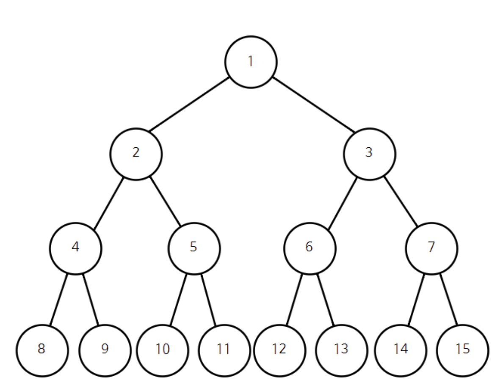

# 이진 트리란?

- 모든 노드가 최대 2개의 자식 노드를 가지는 트리구조
- 왼쪽 자식 : Left Child
- 오른쪽 자식 : Right Child
- 주로 재귀구조로 구현함

## 이진트리 예시코드

```java
class Node {
    int data;
    Node left;
    Node right;

    public Node(int data) {
        this.data = data;
    }
}

```

# 이진트리 순회 (Tree Traversal)

| 순회 방식 | 방문 순서 | 특징 |
| --- | --- | --- |
| 전위 순회 (Preorder) | 루트 → 왼쪽 → 오른쪽 | 루트를 가장 먼저 방문 |
| 중위 순회 (Inorder) | 왼쪽 → 루트 → 오른쪽 | 이진 탐색 트리에서는 정렬된 결과 |
| 후위 순회 (Postorder) | 왼쪽 → 오른쪽 → 루트 | 자식 다 처리 후 루트 방문 (삭제 등에 유용) |

## 순회 구현

```java
class BinaryTree {
    public void preorder(Node node) {
        if (node == null) return;
        System.out.print(node.data + " ");
        preorder(node.left);
        preorder(node.right);
    }

    public void inorder(Node node) {
        if (node == null) return;
        inorder(node.left);
        System.out.print(node.data + " ");
        inorder(node.right);
    }

    public void postorder(Node node) {
        if (node == null) return;
        postorder(node.left);
        postorder(node.right);
        System.out.print(node.data + " ");
    }
}

```



예를 들어 위 예제에서 전위 순회를 이용하면 방문 순서는 다음과 같습니다.

**1 - 2 - 4 - 8 - 9 - 5 - 10 - 11 - 3 - 6 - 12 - 13 - 7 - 14 - 15**

중위 순회는 다음과 같습니다.

**8 - 4 - 9 - 2 - 10 - 5 - 11 - 1 - 12 - 6 - 13 - 3 - 14 - 7 - 15**

마지막으로 후위 순회는 다음과 같습니다.

**8 - 9 - 4 - 10 - 11 - 5 - 2 - 12 - 13 - 6 - 14 - 15 - 7 - 3 - 1**

# Reference

[https://m.blog.naver.com/ndb796/221233560789?recommendTrackingCode=2](https://m.blog.naver.com/ndb796/221233560789?recommendTrackingCode=2)
