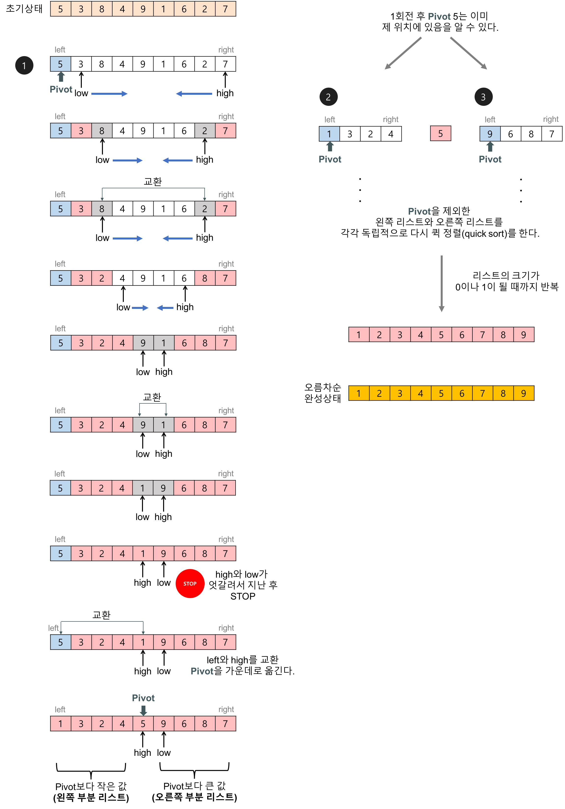
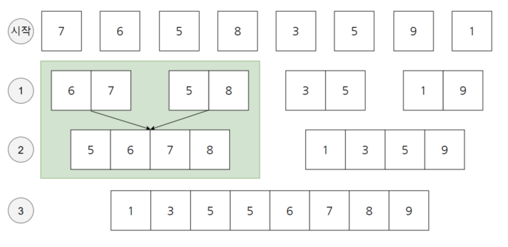
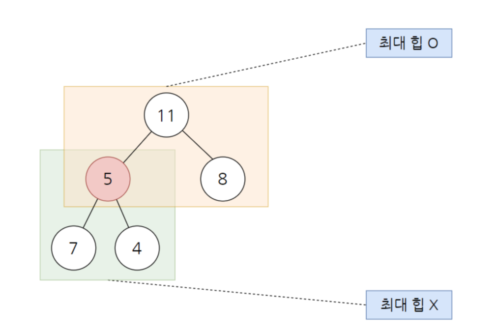
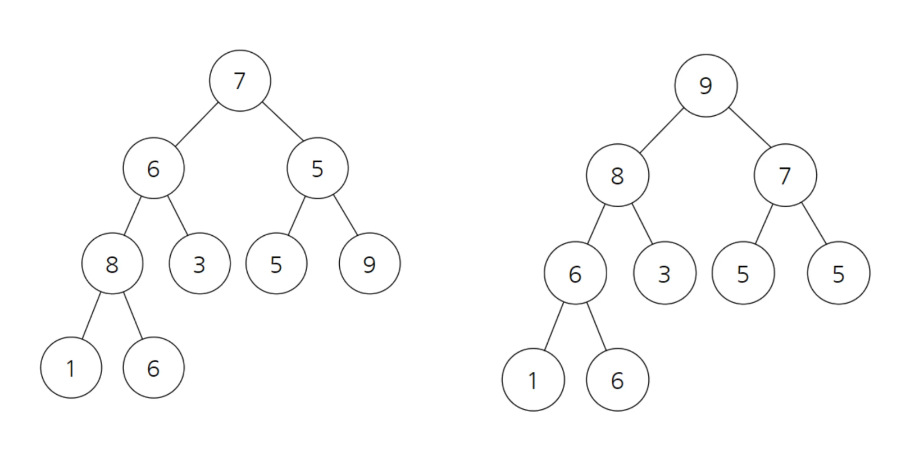

# 선택 정렬

- 가장 작은 것을 선택해서 제일 앞으로 보내는 알고리즘입니다.
- 시간 복잡도 O(N^2)
    - 만약 정렬해야 할 데이터 수가 10,000개라면 일 억 번을 계산해야 합니다.

```c
#include <stdio.h>

int main(void) {
    int i, j, min, index, temp; 
    int array[10] = {11, 10, 5, 8, 7, 6, 4, 3, 2, 9};

    for (i = 0; i < 10; i++) {
        min = 9999;     // 현재 최소값을 매우 큰 수로 초기화
        index = i;      // 현재 위치를 최소 인덱스로 가정

        for (j = i; j < 10; j++) {  // i부터 끝까지 비교
            if (min > array[j]) {  // 더 작은 값을 찾으면
                min = array[j];
                index = j;         // 해당 인덱스를 기억
            }
        }

        // 최소값과 현재 위치 i의 값 교환
        temp = array[i];
        array[i] = array[index];
        array[index] = temp;
    }

    for (i = 0; i < 10; i++) {
        printf("%d ", array[i]);
    }

    return 0;
}

```

# 버블 정렬

- 옆에 있는 값과 비교해서 더 작은 값은 반복적으로 앞으로 보내는 알고리즘 입니다.
- 구현은 쉽지만 가장 비효율적입니다.
- 시간 복잡도 O(N^2)

```c
#include <stdio.h>

int main(void) {
    int i, j, temp;  
    int array[10] = {1, 10, 5, 8, 7, 6, 4, 3, 2, 9};  

    for (i = 0; i < 10; i++) {         
        for (j = 0; j < 9 - i; j++) {    // 이미 정렬된 마지막 부분은 제외
            if (array[j] > array[j + 1]) {
                // 인접한 두 수가 크기 순서가 잘못돼 있으면 교환
                temp = array[j];
                array[j] = array[j + 1];
                array[j + 1] = temp;
            }
        }
    }

    for (i = 0; i < 10; i++) {
        printf("%d ", array[i]);
    }

    return 0;
}

```

# 삽입 정렬

- 각 숫자를 적절한 위치에 삽이하는 알고리즘입니다.
- 어느 정도 정렬이 되어있는 경우 속도가 빠르다는 특징이 있습니다.
- 시간 복잡도 O(N^2)

```c
#include <stdio.h>

int main(void) {
    int i, j, temp;  
    int array[10] = {1, 10, 5, 8, 7, 6, 4, 3, 2, 9};  

    // 삽입 정렬 시작
    for (i = 0; i < 9; i++) { 
        j = i;
        
        // 앞쪽 원소들과 비교하며 올바른 위치에 삽입
        while (j >= 0 && array[j] > array[j + 1]) {
            // 현재 값이 다음 값보다 크면 교환 (오름차순 정렬)
            temp = array[j];
            array[j] = array[j + 1];
            array[j + 1] = temp;
            j--; // 왼쪽으로 한 칸 이동하여 다시 비교
        }
    }

    for (i = 0; i < 10; i++) {
        printf("%d ", array[i]);
    }
    
    return 0;
}

```

# 퀵 정렬

- 대표적인 빠른 정렬 알고리즘
- 분할 정복 알고리즘
- 피벗을 기준으로 반을 나눠 작게 쪼갠 뒤
- 시간 복잡도
    - 평균 O(N * logN)
    - 최악(이미 정렬이 되어 있는 경우) O(N^2)



```c
#include <stdio.h>

int number = 10;
int data[] = {1, 10, 5, 8, 7, 6, 4, 3, 2, 9};

void show() {
    int i;
    for (i = 0; i < number; i++) {
        printf("%d ", data[i]);
    }
}

void quickSort(int* data, int start, int end) {
    if (start >= end) return;  // 원소가 1개인 경우 그대로 두기

    int key = start;           // 키는 첫 번째 원소
    int i = start + 1;
    int j = end;
    int temp;

    while (i <= j) {  // 엇갈릴 때까지 반복
        while (i <= end && data[i] <= data[key]) {
            i++;  // 키 값보다 큰 값 찾을 때까지
        }
        while (j > start && data[j] >= data[key]) {
            j--;  // 키 값보다 작은 값 찾을 때까지
        }

        if (i > j) {  // 엇갈린 경우: 키 값과 data[j] 교환
            temp = data[j];
            data[j] = data[key];
            data[key] = temp;
        } else {      // 엇갈리지 않았으면 i, j 교환
            temp = data[i];
            data[i] = data[j];
            data[j] = temp;
        }
    }

    quickSort(data, start, j - 1);  // 왼쪽 정렬
    quickSort(data, j + 1, end);    // 오른쪽 정렬
}

int main(void) {
    quickSort(data, 0, number - 1);
    show();
    return 0;
}

```

# 병합 정렬

- 반으로 나눈 후 합치면서 정렬하는 알고리즘
- 기존 데이터를 담을 추가적인 공간이 필요 → 메모리 비효율적
- 하지만 어떤 상황에서도 시간복잡도 O(N * logN)를 보장한다는 장점이 있습니다.



```c
#include <stdio.h>

int number = 8;                // 배열 크기

int size;
int sorted[8];                 // 정렬 임시 저장 배열 (전역으로 선언해야 재귀 호출 시 유지됨)
int count = 0;          

// 병합 과정: 두 정렬된 구간 [m ~ middle], [middle+1 ~ n]을 하나로 합침
void merge(int a[], int m, int middle, int n) {
    int i = m;
    int j = middle + 1;
    int k = m;

    // 두 구간을 비교하면서 작은 값을 sorted 배열에 넣음
    while (i <= middle && j <= n) {
        if (a[i] <= a[j]) {
            sorted[k] = a[i];
            i++;
        } else {
            sorted[k] = a[j];
            j++;
        }
        k++;
    }

    // 왼쪽 구간이 먼저 끝났을 경우 → 오른쪽 구간 남은 값 복사
    if (i > middle) {
        for (int t = j; t <= n; t++) {
            sorted[k] = a[t];
            k++;
        }
    }
    // 오른쪽 구간이 먼저 끝났을 경우 → 왼쪽 구간 남은 값 복사
    else {
        for (int t = i; t <= middle; t++) {
            sorted[k] = a[t];
            k++;
        }
    }

    // 정렬된 값들을 원래 배열로 복사
    for (int t = m; t <= n; t++) {
        a[t] = sorted[t];
    }
}

// 병합 정렬 재귀 호출
void mergeSort(int a[], int m, int n) {
    if (m < n) { // 배열 크기가 1 초과일 때만 실행
        int middle = (m + n) / 2;
        mergeSort(a, m, middle);          // 왼쪽 절반 정렬
        mergeSort(a, middle + 1, n);      // 오른쪽 절반 정렬
        merge(a, m, middle, n);           // 두 부분 병합
    }
}

int main(void) {
    int array[number] = {7, 6, 5, 8, 3, 5, 9, 1};  

    mergeSort(array, 0, number - 1); 

    for (int i = 0; i < number; i++) {
        printf("%d ", array[i]);
    }

    return 0;
}

```

# 힙(heap) 정렬

힙은 최솟값이나 최댓값을 빠르게 찾아내기 위한 `완전이진트리`를 기반으로 하는 트리
힙은 `최대 힙`과 `최소 힙`이 존재
최대 힙 = 부모 노드가 가장 큰 힙
최소 힙 = 부모노드가 가장 작은 힙

시간복잡도 O(NlogN)

---

아래의 경우 5가 7보다 작지만 7의 부모노드로 있기 때문에 최대힙이 성립이 안 된다.
이럴 경우 최대 힙으로 만들기 위해서 5와 7을 바꿔주면 된다.



## 예시

- “7 6 5 8 3 5 9 1 6”을 오름차순 정렬하세요

여기에서 가장 쉽게 트리를 표현하는 방법은 인덱스 순서대로 표현하는 것입니다.(왼쪽 트리)
하지만 이렇게 표현을 하면 최대 힙이 아니므로 정리를 해야 합니다. ( 오른쪽 트리)



```cpp
#include <stdio.h>

int number = 9;
int heap[9] = {7, 6, 5, 8, 3, 5, 9, 1, 6};

int main(void) {
    // 힙 구성
    for(int i = 1; i < number; i++) {
        int c = i;
        do {
            int root = (c - 1) / 2;
            if(heap[root] < heap[c]) {
                int temp = heap[root];
                heap[root] = heap[c];
                heap[c] = temp;
            }
            c = root;
        } while (c != 0);
    }

    // 크기를 줄여가며 반복적으로 힙을 구성
    for(int i = number - 1; i >= 0; i--) {
        int temp = heap[0];
        heap[0] = heap[i];
        heap[i] = temp;

        int root = 0;
        int c = 1;
        do {
            c = 2 * root + 1;
            // 자식 중에 더 큰 값을 찾기
            if(c < i - 1 && heap[c] < heap[c + 1]) {
                c++;
            }
            // 루트보다 자식이 크다면 교환
            if(c < i && heap[root] < heap[c]) {
                temp = heap[root];
                heap[root] = heap[c];
                heap[c] = temp;
            }
            root = c;
        } while (c < i);
    }

    // 결과 출력
    for(int i = 0; i < number; i++) {
        printf("%d ", heap[i]);
    }
}

```

# 계수 정렬

범위 조건이 있는 경우 굉장히 빠르다
시간 복잡도 O(N)

숫자 크기만큼의 배열 하나를 만들어주고
정렬해야 할 숫자들의 개수를 차례로 세어줍니다.
수를 다 세었다면 갯수만큼 그 수를 출력을 하면 됩니다.

## 예제

아래의 수를 정렬하시오

1 3 2 4 3 2 5 3 1 2 3 4 4 3 5 1 2 3 5 2 3 1 4 3 5 1 2 1 1 1

크기 1-5

|  | 크기 = 1 | 크기 = 2 | 크기 = 3 | 크기 = 4 | 크기 = 5 |
| --- | --- | --- | --- | --- | --- |
| 처음 상태 | 0 | 0 | 0 | 0 | 0 |
| 최종 상태 | 8 | 6 | 8 | 4 | 4 |

```cpp
#include <stdio.h>

int main(void)
{
    int temp;
    int count[6];
    int array[30] = {
        1, 3, 2, 4, 3, 2, 5, 3, 1, 2,
        3, 4, 4, 3, 5, 1, 2, 3, 5, 2,
        3, 1, 4, 3, 5, 1, 2, 1, 1, 1
    };

    // 카운트 배열 초기화
    for(int i = 1; i <= 5; i++)
    {
        count[i] = 0;
    }

    // 각 숫자의 개수 세기
    for(int i = 0; i < 30; i++)
    {
        count[array[i]]++;
    }

    // 정렬된 형태로 출력
    for(int i = 1; i <= 5; i++)
    {
        if(count[i] != 0)
        {
            for(int j = 0; j < count[i]; j++)
                printf("%d ", i);
        }
    }

    return 0;
}
```

# Reference

[https://m.blog.naver.com/ndb796/221227934987?recommendTrackingCode=2](https://m.blog.naver.com/ndb796/221227934987?recommendTrackingCode=2)
