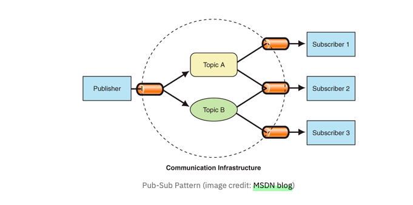
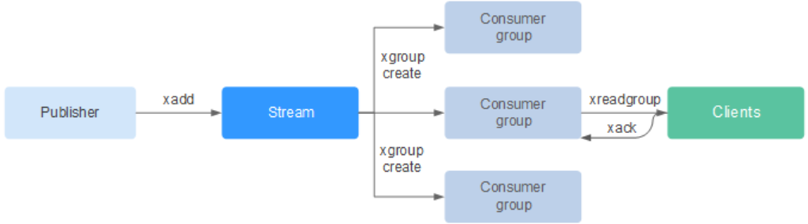

# Redis Pub/Sub

- 메세지 큐를 이용하여 해당 Topic(채널)을 구독하는 구독자(SubScription)에게 메시지를 발행(Publish)
- 발행-구독(Publish/Subscribe) 패턴의 단순 메시지 브로드캐스트 시스템
- **채널(channel)** 단위로 메시지를 **실시간 전달**하며, **메시지를 저장하지 않음**

## 구조

## 특징

- Publisher는 각 Topic(채널)에 대한 Subscriber 정보를 알 수 없다
    - IF - Topic A를 구독하는 구독자가 없어도 메시지는 발행되며, 추후 구독자가 발행해도 이전 발행된 메시지는 확인 불가
    - Publisher는 메시지를 따로 저장하지 않으며, 구독자(Subscriber)의 네트워크 장애 발생 때 발행된 메시지는 확인 불가
- 메시지는 발행 시점에 **구독 중인 Subscriber에게만 전달**
- **과거 메시지 조회 불가** → 휘발성
    - 실시간 알림, 채팅, 상태 알림, 센서 데이터 전송 등 휘발되어도 되는 데이터 전파
- Publisher는 Subscriber의 존재를 몰라도 됨
- Subscriber가 **잠시 끊기면 해당 시간의 메시지는 영영 손실됨**

# Redis Stream

- Log 파일처럼 적재되는 Append Only(수정불가)의 구조
- 발행할 메시지를 stream에 적재
- **Append-Only** 구조의 로그 기반 메시지 큐
- 발행된 메시지를 **디스크에 저장**하고, **소비자가 ID 기반으로 소비**
- Kafka와 유사한 **Consumer Group**, **ack 기반 처리**, **처리 재시도**, **내구성 보장**
- 비동기 이벤트 처리, MSA 간 이벤트 브로커, 실패 복구가 필요한 로직에서 사용

## 구조

- 발행된 데이터를 Stream에 적재하여 해당 Stream Id를 구독하는 소비그룹(Consumer Group)이 해당 Stream에 담김 메시지를 소모(Consumed)한다.

## 특징

- Redis 메시지큐에 전달하여 구독자(Subscriber)에게 전달되는 구조가 아닌
    - 로그 형식으로 Stream에 적재되는 특성
- MSA 구조로 개발하기 용이하다.
    - 주문기능, 결제기능을 분리하여 결제기능 장애발생 시에도 주문기능을 사용할 수 있다
    → 결제기능이 복구되었을 때 적재된 주문리스트를 처리할 수 있다.
- 메시지 유실 없음: 저장 후 소모되며, ack를 통해 처리 보장
- **여러 Consumer Group**이 서로 독립적으로 메시지 소비 가능 (pub/sub과 결정적 차이)
- 메시지 수동 삭제 가능 (수동 트림 또는 시간/길이 기반 자동 삭제)

# Pub/Sub과 Stream의 기능 차이점

- Redis Stream에서는 Stream에 쌓여있는 데이터를 이후에 발행한 소비그룹(Consumer Group)에서 소모할 수 있으므로, Pub/Sub의 메시지 휘발성 문제를 커버할 수 있다.
- Redis Stream에서 해당 Stream에 대한 다중 소비그룹이 있다면 분산 처리가 가능하나,
Redis Pub/Sub에서는 해당 Topic(채널)을 구독하는 모든 구독자에게 메시지가 발행되므로 분산 처리가 어려움

# RabbitMQ와 Kafka

## Redis Pub/Sub 과 RabbitMQ (기본 Exchange + Queue 구조)

| 항목 | Redis Pub/Sub | RabbitMQ |
| --- | --- | --- |
| 메시지 저장 | 안 함 (휘발성) | Queue에 저장됨 (일정 기간 유지 가능) |
| 메시지 소비 | 즉시 브로드캐스트 | 소비자가 Queue에서 꺼냄 (ack 가능) |
| 메시지 보장 | 구독 중일 때만 수신 가능 | 메시지 손실 없이 재전송 가능 (ack 기반) |
| 특징 | 단순, 빠름, 설정 간편 | 중간 정도 복잡도, 신뢰성 높음 |
| 적합 | 실시간 채팅, 알림 | 주문 처리, 결제, 이메일 발송 등 |

## Redis Stream 과 Kafka (Log 기반 메시지 브로커)

| 항목 | Redis Stream | Kafka |
| --- | --- | --- |
| 메시지 저장 | Stream(Log) 형태로 저장 | Topic(Log) 형태로 저장 |
| 메시지 소비 | ID 기반으로 읽고 ack | Offset 기반으로 읽음 |
| 메시지 보장 | 강력한 내구성 (ack 기반) | 분산처리 및 장애 복구 가능 |
| Consumer Group | 존재 (Group마다 ID 관리) | 존재 (Offset 관리) |
| 특징 | 단일 노드 기반, 설정 간단 | 분산/복제/파티셔닝까지 완비 |
| 적합 | MSA 이벤트 큐, 비동기 프로세싱 | 고성능 로그 수집, 실시간 분석 파이프라인 |

## 우체통과 비유

| 시스템 | 비유 설명 | 메시지 흐름 |
| --- | --- | --- |
| **Kafka** | *우체부가 우체통에 편지를 넣고 간다*
소비자는 우체통에서 꺼내어 본다 | 우편은 보관된다 (우체통=log)
여러 명이 각자 꺼내어 읽을 수 있다 |
| **RabbitMQ** | *소비자가 우체국에 가서 편지를 수령한다*
우체국은 편지를 임시 보관하고 있다 | 우체국(큐)에 잠시 저장
소비자가 꺼내면 사라짐 (ack 기반) |
| **Redis Pub/Sub** | *스피커로 방송하듯 메시지를 외친다*
듣고 있는 사람만 내용을 받을 수 있음 | 저장되지 않음
나중에 듣는 사람은 놓침 |
| **Redis Stream** | *모든 편지를 시간 순으로 우체통에 쌓는다*
소비자 그룹은 우체통에서 필요한 걸 꺼낸다 | 편지(Log)로 남음
그룹별로 따로 관리 가능 (ack 포함) |
- **Kafka**: "각자 자기 우체통에서 꺼내보는 구조" (로그 중심, 고신뢰, 고성능)
- **RabbitMQ**: "우체국에서 번호표 뽑고 받는 구조" (큐 중심, 안정적 라우팅)
- **Redis Pub/Sub**: "확성기로 외침 → 지금 듣는 사람만 받음" (즉시성, 휘발성)
- **Redis Stream**: "모든 메시지를 일기장에 씀 → 나중에 다시 볼 수 있음" (로그형 큐, MSA에 유리)

# Reference

[https://dev-swlee.tistory.com/27](https://dev-swlee.tistory.com/27)

[https://redis.io/docs/latest/develop/pubsub/](https://redis.io/docs/latest/develop/pubsub/)

[https://redis.io/docs/latest/develop/data-types/streams/](https://redis.io/docs/latest/develop/data-types/streams/)
