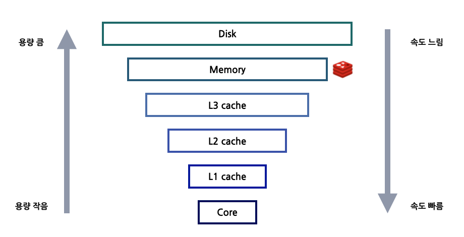
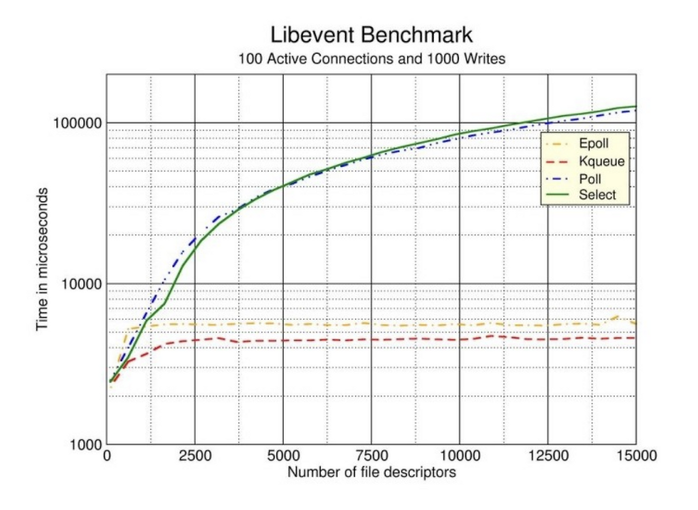

# In-Memory DB

Redis가 빠른 첫 번째 이유는 In-Memory DataBase이기 때문이다.

- Memory Access 시간은 Random disk I/O보다 몇 배는 더 빠르다.
- 메모리 엑세스는 높은 Read/Write 처리량과 낮은 지연이라는 장점이 있다.
- 단점으로는 데이터 저장 크기가 메모리라서 크지 않다는 점이다.

또한 메모리 내 데이터 구조는 디스크 상의 데이터 구조보다 구현하기가 훨씬 쉽다. 이러한 점이 코드를 간단하게 만들고 Reids의 `rock-solid`에 기여한다.

# I/O multiplexing

Redis는 `싱글스레드`로 디자인 된 `인메모리` 저장소이다.

멀티 스레드 앱은 `lock` 또는 `동기화` 메커니즘이 필요하다. 이러한 `동시성` 문제는 원인을 알아내기 어려운 것으로 유명하다. 그래서 많은 앱에서 이러한 메모리 계층에 버그가 발생하기 쉽고 안정성이 깨지는 복잡성을 추가하면서까지 성능 향상을 이뤄야 하는지에 대한 의문을 갖게 된다.

- 단일 스레드 코드베이스는 수천 개의 요청과 응답을 동시에 어떻게 처리할 수 있는 것일까?
- 각 요청이 개별적으로 완료될 때까지 스레드가 차단 되지 않나?

> 왜 Redis는 싱글 스레드임에도 불구하고 높은 성능을 보이는 것인가
스레드를 사용하여 모든 CPU 코어를 활용하면 더 빠르지 않을까?
> 

이제 `I/O 멀티플렉싱`이 등장한다.
**I/O 멀티플렉싱을 통해 OS는 단일 스레드가 동시에 많은 소켓 커넥션**을 `대기`할 수 있도록 한다.
이러한 `리액터 설계 패턴`은 `Reactive programming`에서도 쓰이는 개념이다.

Illustration of IO Multiplexing & Single-threaded execution (ByteByteGo)

I/O 멀티플렉싱 기법을 사용하여도 입출력 다중화에서 입출력 함수 자체는 여전히 블록하는 것으로 작동한다.
하지만 입출력 함수를 호출하기 전에 **어떤 파일에서 입출력이 준비 됐는지를 확인할 수 있다**는 장점이 있다.
기존 블로킹 I/O 모델과 비교해보자

## 블로킹 I/O 모델

read 함수는 커널 공간에서 요청 데이터가 도착하길 기다리는 것부터 시작한다.
그래서 스레드가 read 함수를 호출하면 네트워크를 통해 상대방의 데이터가 커널 공간에 도착해 유저 공간의 버퍼에 데이터가 복사될 때까지 block된 상태로 있어야 한다.
이러한 블로킹 I/O 모델은 멀티 스레딩을 통해 입출력 다중화를 구현할 수 있다.

Blocking I/O model

## I/O 멀티플렉싱 모델

`멀티플렉싱`은 **하나의 스레드에서 다수 클라이언트에 연결된 소켓(파일 디스크립터)를 관리**하면서 소켓에 이벤트(read/write)가 발생할 때만 해당 이벤트를 처리하도록 구현함으로써 `멀티 프로세싱`, `멀티 스레딩` 방식보다 더 적은 리소스를 사용한다.
그리고 멀티플렉싱 모델에서는 select함수를 사용한다. 해당 함수를 호출해서 여러 개의 소켓 파일 중 read 함수로 데이터 호출이 가능한 소켓이 생길 때까지 대기한다. select 함수 결과 값으로 read 함수를 호출할 수 있는 소켓의 목록이 반환되면 이제 다시 read 함수를 통해 해당 데이터들을 유저 공간으로 복사해온다.

I/O multiplex model

블로킹 I/O 모델이 멀티 스레딩, 프로세싱으로 입출력 다중화를 구현하는 반면
I/O 멀티 플렉싱은 하나의 스레드로 처리할 수 있다는 것이 아주 큰 장점이다 그리고 전통적으로 이것은 `select` 또는 `poll시스템 콜`로 수행된다. 
그러나 해당 시스템 콜은 수천 개의 커넥션이 생성되었을 때 모든 파일을 스캔해야 하므로 O(n)으로 성능이 별로 좋지 않다. 
그래서 Linux에서 `epoll()`이나 FreeBSD의 `kqueue()`를 사용하면 O(1) 상수 시간으로 전체 파일 셋이 아닌 변경 사항이 있는 파일만 던져주므로 성능이 좋다.

- select() : 결과 값으로 어떤 파일 디스크립터에서 이벤트가 발생했는지 확인하기 위해서는 매번 fd_set 테이블 전체를 검사해야 한다. O(n)
- poll() : 여러 개의 파일을 다루는 방법은 select와 같다. 이벤트가 발생하면, poll에서의 블록이 해제되고 전체 데이터를 탐색한다. O(n)
- Linux의 `epoll()`, FreeBSD의 `kqueue()` : poll의 단점을 해결할 수 있는 **멀티플렉싱을 지원**한다. 정보를 유저 공간이 아닌 커널 공간에서 처리한다. 그래서 처음에 정보만 전달하고 내용 변경이 있을 때에만 커널에게서 알림을 받는다. O(1)

정리해보면 [Redis는 여러 구현(select, epoll, kqueue 등)을 캡슐화하는 리액터 설계 패턴을 사용](https://github.com/redis/redis/blob/unstable/src/ae.c)하여 클라이언트의 요청을 처리하기 위해 I/O 멀티플렉싱을 사용한다.
Redis는 여러 플랫폼에서 실행되어야 하고 실행의 효율성과 성능을 극대화해야 하므로 서로 다른 컴파일 플랫폼에 따라 서로 다른 I/O 멀티플렉싱 기능이 하위 모듈로 선택된다. 
Redis는 Solaris 10의 evport, Linux의 epoll 및 Mac OS/FreeBSD의 kqueue를 포함하여 시간 복잡도가 O(1)인 I/O 멀티플렉싱 기능을 기본 구현으로 우선적으로 선택한다. 
 

## TIP) CPU 집약적인 O(n) 연산 회피하기

Redis는 싱글 스레드 설계를 사용하지만, 최신 하드웨어에 있는 다중 CPU 코어를 완전히 활용하지 못하는 경우가 많다. 이를 극복하기 위해 많은 사람들이 **단일 서버에서 여러 개의 Redis 인스턴스를 실행하여 더 많은 CPU 코어를 활용**하려고 한다.

Redis에 대해 이해해야 할 중요한 점은 **O(n) 연산에 대한 민감도**이다. **싱글 스레드임에도 I/O multiplex 기술을 통해 동시에 수 많은 클라이언트 요청을 처리**한다. 그러나 이러한 효율성은 O(n) 연산에 의해 방해받을 수 있다. CPU 집약적인 작업을 처리하게 되면 대기 중인 수 많은 요청들은 지연되어 잠재적인 **성능 병목 현상**으로 이어질 가능성이 높기 때문이다.

- [keys](https://redis.io/commands/keys/) (x) → [scan](https://redis.io/commands/scan/) (o): [Redis의 SCAN은 어떻게 동작하는가?](https://tech.kakao.com/2016/03/11/redis-scan/#redis%EC%9D%98-re-hashing) 참고
- [delete](https://redis.io/commands/del/) (x) → [unlink](https://redis.io/commands/unlink/) (o): delete는 삭제할 키 전체 탐색 후 삭제 O(n), unlink는 async/non-blocking으로 동작하여 O(1) 연산으로 키 연결 해제 (이후 다른 스레드가 O(n)으로 추가 메모리 회수 작업 수행)

# Reference

[https://loosie.tistory.com/872](https://loosie.tistory.com/872)
