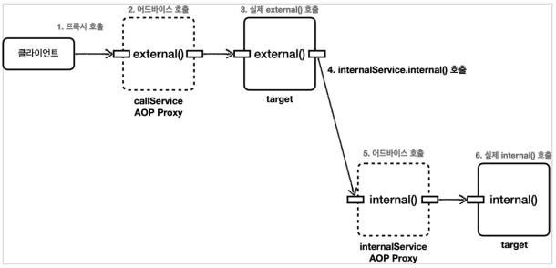
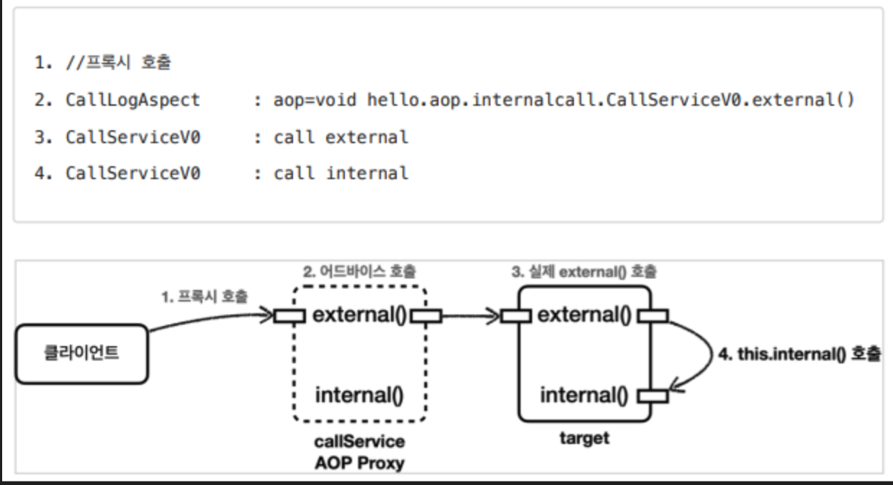

# AOP 프록시 내부 작동 방식

Spring AOP는 트랜잭션 처리, 로깅, 실행 시간 측정 등 공통 기능을 비즈니스 로직에서 분리해주는 도구입니다.

하지만 내부적으로는 `‘프록시’`라는 기술을 기반으로 작동하기 때문에 특정한 한계가 있으며, 문제가 발생할 수도 있습니다.

# AOP란?

AOP는  ‘공통 기능’을 핵심 로직과 분리하여,
코드를 더 깔끔하고 모듈화할 수 있게 도와줍니다.

- 예
    - 핵심기능 : 주문 등록
    - 공통 기능 : 로깅, 실행 시간 측정

# Spring AOP의 내부 작동 방식

Spring AOP는 **런타임 시점**에 프록시 객체를 생성하여,

비즈니즈 메서드를 호출할 때 **그 전/후로 공통 기능(Advice)를 실행**합니다.

즉, 클라이언트는 원래 객체가 아닌
**AOP 프록시 객체를 통해 메서드를 호출**하게 됩니다.

하지만 대상 객체에서 프록시를 거치지 않고 직접 대상 객체를 호출하는 경우가 있는데 그럴 경우 문제가 발생한다.

## 내부 호출이 발생하는 예제

CallServiceV0.java

```java
@Slf4j
@Component
public class CallServiceV0 {
    public void external() {
        log.info("call external");
        internal(); //내부 메서드 호출(this.internal())
    }
    public void internal() {
        log.info("call internal");
    }
}
```

CallLogAspect.java

```java
@Slf4j
@Aspect
public class CallLogAspect {
    @Before("execution(* hello.aop.internalcall..*.*(..))")
    public void doLog(JoinPoint joinPoint) {
    	log.info("aop={}", joinPoint.getSignature());
    }
}
```

CallServiceV0Test

```java
@Import(CallLogAspect.class)
@SpringBootTest
class CallServiceV0Test {
    @Autowired
    CallServiceV0 callServiceV0;
    
    @Test
    void external() {
        callServiceV0.external();
    }
    
    @Test
    void internal() {
        callServiceV0.internal();
    }
}
```

### 내부 구조 흐름



```java
[클라이언트]
   ↓                         ← ① 클라이언트가 external() 호출
[AOP 프록시 객체]  
   ↓                         ← ② 프록시가 AOP 어드바이스 실행
[실제 대상 객체 (target)]  
   ↓                         ← ③ external() 내부 로직 실행
[this.internal()]  
   ↳ 내부 호출로 프록시 우회 ← ④ 여기서 AOP 적용X
```

즉, 외부에서 프록시를 통해 들어올 때만 AOP가 적용되고
내부 호출(.this)은 프록시를 거치지 않아 AOP가 무시되는 문제가 발생합니다.

## 해결 방법

### 1. 자기 자신 주입

```java
/**
 * 참고: 생성자 주입은 순환 사이클을 만들기 때문에 실패한다.
 */
@Slf4j
@Component
public class CallServiceV1 {
    private CallServiceV1 callServiceV1;
    
    @Autowired
    public void setCallServiceV1(CallServiceV1 callServiceV1) { // 이런식으로
        this.callServiceV1 = callServiceV1;
    }
    
    public void external() {
        log.info("call external");
        callServiceV1.internal(); //외부 메서드 호출
    }
    
    public void internal() {
        log.info("call internal");
    }
}
```

이 경우 `생성자 주입`시 오류가 발생합니다. 본인을 생성하면서 주입을 하기 때문에 순환 사이클이 만들어집니다.
반면 `수정자 주입`은 스프링이 생성된 이후에 주입할 수 있기 대문에 오류가 발하지 않습니다.

### 2. 지연 조회

앞의 `생성자 주입`은 자기 자신을 생성하면서 주입하기 때문에 실패합니다.
이 경우 `수정자 주입`, `지연 조회`를 사용하면 됩니다.

```java
/**
 * ObjectProvider(Provider), ApplicationContext를 사용해서 지연(LAZY) 조회
 */
@Slf4j
@Component
@RequiredArgsConstructor
public class CallServiceV2 {
    // private final ApplicationContext applicationContext;
    private final ObjectProvider<CallServiceV2> callServiceProvider;
    
    public void external() {
        log.info("call external");
        // CallServiceV2 callServiceV2 = 
        applicationContext.getBean(CallServiceV2.class);
        
        // 아래처럼 ObjectProvider 또는 ApplicationContext를 이용해 지연 조회
        CallServiceV2 callServiceV2 = callServiceProvider.getObject(); // 지연 주입
        callServiceV2.internal(); //외부 메서드 호출
    }
    
    public void internal() {
    	log.info("call internal");
    }
}
```

### 구조 변경

```java
/**
 * 구조를 변경(분리)
 */
@Slf4j
@Component
@RequiredArgsConstructor
public class CallServiceV3 {
    private final InternalService internalService;
    
    public void external() {
        log.info("call external");
        internalService.internal(); //외부 메서드 호출
    }
}
```

InternalService.java

```java
@Slf4j
@Component
public class InternalService {
    public void internal() {
    	log.info("call internal");
    }
}
```



## 요약

내부에서 `this.메서드()` 형태로 직접 호출하면 프록시를 우회하게 되어 `AOP`가 동작하지 않았습니다.
해결 방법으로 대상 메서드를 별도의 `Bean`으로 분리해서 외부 호출 구조를 만들면
`external()`과 `internal()` 모두에 정상적으로 AOP 적용 가능합니다.

# Reference

[https://soso-shs.tistory.com/60](https://soso-shs.tistory.com/60)

[https://m.blog.naver.com/fbfbf1/223225345341](https://m.blog.naver.com/fbfbf1/223225345341)
