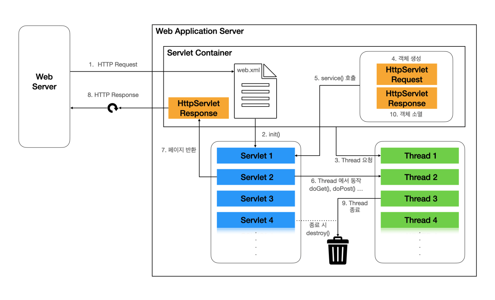

# 개념 비교

| 구분 | Servlet Container | Spring Container |
| --- | --- | --- |
| 정의 | 서블릿을 생성하고 실행시켜주는 **웹 서버의 실행 환경** | 스프링 빈(`Bean`)을 생성하고 관리하는 **스프링 프레임워크의 핵심** |
| 대표 구현체 | `Tomcat`, `Jetty`, `Undertow` 등 | `ApplicationContext`, `WebApplicationContext` |
| 생성 주체 | `WAS` (Tomcat 등) | 스프링 프레임워크 |
| 관리 대상 | 서블릿, 필터, 리스너 | 스프링 빈 (`@Service`, `@Repository` 등) |

# Servlet Container

## 1. 서블릿의 생성

- **Servlet Container**는 클라이언트 요청에 따라 서블릿이 필요할 경우, 해당 서블릿을 **생성하고 `init()` 메서드를 호출**하여 초기화합니다.
- `init()` 메서드는 **서블릿 인스턴스가 처음 생성될 때 단 한 번만 호출**되며, 자원 로딩, 설정값 초기화 등의 작업을 수행합니다.
- 이 과정에서 Spring 환경이 구성되어 있다면, **Spring Container를 통해 필요한 Bean을 생성하거나 주입받는 구조도 함께 작동**할 수 있습니다.
- 초기화된 서블릿 인스턴스는 메모리에 상주하며, **Servlet의 생명주기가 시작**됩니다.

## 2. 클라이언트 요청 수신 시 처리 과정

- 웹 브라우저로부터 요청이 들어오면, **Servlet Container는 요청 URL을 분석**하여 이를 처리할 서블릿을 찾습니다.
- 기존 방식에서는 `web.xml`에 등록된 URL-서블릿 매핑 정보를 기반으로 탐색합니다.
- 매핑된 서블릿이 존재하지 않으면, **Servlet을 새로 생성 및 초기화한 뒤** 서비스에 참여시킵니다.
- 요청이 처리될 때, **Servlet Container는 새로운 스레드를 생성하고**
    
    `HttpServletRequest`, `HttpServletResponse` 객체를 생성한 뒤,
    
    해당 서블릿의 `service()` 메서드를 호출합니다.
    
- 만약 Spring Boot 환경이라면, `@EnableAutoConfiguration`, `@ComponentScan`, `@Configuration` 등의 어노테이션 기반 설정을 통해
    
    별도의 `web.xml` 없이도 **자동으로 서블릿이 등록 및 구성**됩니다.
    

## 3. Servlet 인스턴스의 요청 처리

- Servlet 인스턴스는 **`service()` 메서드를 통해 진입**하며,
    
    요청 방식에 따라 `doGet()`, `doPost()` 등의 메서드가 실행됩니다.
    
- 이때, **Servlet Container가 제공하는 `HttpServletRequest` 객체를 통해 요청 정보를 수신**하고,
    
    **`HttpServletResponse` 객체를 통해 응답 데이터를 구성**합니다.
    
- 모든 처리가 완료되면, 응답 데이터는 HTTP Response 형태로 전환되어 웹 서버로 전달됩니다.
- 요청 처리가 완료되면, **해당 스레드는 종료**되며, 사용된 `HttpServletRequest`, `HttpServletResponse` 객체 역시 **GC의 대상**이 됩니다.

## 4. 서블릿의 소멸

- 웹 애플리케이션이 종료되거나, 해당 서블릿이 더 이상 필요하지 않게 되면
    
    **Servlet Container는 `destroy()` 메서드를 호출**하여 서블릿 인스턴스를 소멸시킵니다.
    
- 이 과정에서 서블릿이 사용하던 리소스를 정리하고 해제합니다.
- 이후, Servlet 객체는 **Java의 Garbage Collector에 의해 메모리에서 완전히 제거**됩니다.

## 전체 흐름 요약

- 클라이언트 요청 → 서블릿 탐색/생성 → 요청 처리 → 응답 전송 → 리소스 해제


# Spring Container

## 1. Servlet Container와 Spring Container의 관계

- Servlet Container는 **서블릿 객체를 생성하고 초기화하는 환경**을 제공합니다.
- Spring Container는 서**블릿이 정상적으로 동작하는 데 필요한 객체(Bean)들**을 생성하고, **의존성을 주입(DI)**하는 역할을 합니다.
- 이처럼 두 컨테이너는 **서로 밀접한 관계**에 있으며, Spring Container를 이해하는 것은 전체 Spring 기반 애플리케이션 구조를 파악하는 데 매우 중요합니다.

## 2. Spring Container란?

Spring Container는 다음과 같은 역할을 수행합니다:

- **Bean 객체 생성**
- **Bean 간 의존성 주입(DI) 관리**
- **Bean 생명주기 관리**
- **AOP, 이벤트, 프로파일 등 Spring 기능 지원**

Spring Container는 객체를 직접 생성하고 관리하기 때문에

**Inversion of Control(IoC)** 방식이라 부르며,

개발자는 객체 생성 및 관계 설정이 아닌, **서비스 로직에 집중**할 수 있게 됩니다.

따라서 `Spring Container`는 `IoC Container`라고도 불립니다.

## 3. IoC와 DI란?

### IoC (Inversion of Control, 제어의 역전)

- IoC는 객체의 생성과 의존성 설정에 대한 제어 권한을 개발자가 아닌 외부(스프링 컨테이너)가 가지는 설계 방식입니다.
- 애플리케이션의 흐름 제어를 개발자가 직접 하는 것이 아니라 **프레임워크가 주도**한다는 의미에서 “제어의 역전”이라 부릅니다.

### DI (Dependency Injection, 의존성 주입)

- DI는 **IoC를 구현하는 대표적인 방법**입니다.
- 객체가 필요한 의존 객체를 직접 생성하지 않고, **외부에서 주입**받도록 합니다.

### 예시 비교

```java
// 예시 1: 직접 생성 → 강한 결합
public class Aclass {
    private Bclass b = new Bclass();
}

```

```java
// 예시 2: 생성자 주입 (DI) → 느슨한 결합
public class Aclass {
    private Bclass b;
    public Aclass(Bclass b) {
        this.b = b;
    }
}

```

- 생성자 외에도 Setter 주입, 인터페이스 주입 방식이 있으며,
Spring에서는 `@Autowired`, `@Qualifier` 등을 통해 **자동 주입**이 가능합니다.

## 4. Spring Container의 빈(Bean) 등록 방식

### 주요 어노테이션

| 어노테이션 | 역할 |
| --- | --- |
| `@Component` | 일반적인 빈 |
| `@Service` | 서비스 레이어 빈 |
| `@Repository` | DAO (JPA 등) 빈 |
| `@Controller` | 웹 요청 처리용 빈 |
| `@Configuration` | 설정 클래스 |

### 컴포넌트 스캔

Spring은 `@ComponentScan`을 통해 지정된 패키지 내의 클래스를 탐색하여 **자동으로 빈으로 등록**합니다.

옵션: `basePackages`, `includeFilters`, `excludeFilters` 등

## 5. Spring Container의 종류

| 분류 | 설명 |
| --- | --- |
| `BeanFactory` | 가장 기본적인 컨테이너. Lazy 방식. 최소 기능만 제공 |
| `ApplicationContext` | BeanFactory의 상위 개념. 다양한 부가 기능 포함 (이벤트, 메시지, AOP 등) |

## 6. 주요 Spring Container 구현체

### 1. ClassPathXmlApplicationContext, FileSystemXmlApplicationContext

- XML 파일 기반으로 빈을 등록/관리
- `ClassPathXmlApplicationContext`는 `resources/` 하위에서 XML 파일을 로드
- `FileSystemXmlApplicationContext`는 **파일 시스템 경로 기반 로드**

### 단점

- 설정 변경 시 **빌드/배포 필요**
- XML 설정이 많아지면 **가독성 저하**
- 동적 변경이 어려움 → **대규모 프로젝트에는 부적합**

### 2. AnnotationConfigApplicationContext

- **자바 기반 설정**을 사용하는 가장 일반적이고 현대적인 방식
- `@Configuration`, `@Bean`, `@ComponentScan` 등을 통해 빈 설정

### 장점

- **타입 안전성**, **컴파일 타임 오류 검출**
- 코드 기반 설정으로 가독성 및 유지보수 용이
- XML 설정 불필요

# 결론

- **`Servlet Container`**는 서블릿 객체와 요청을 관리하고,
**`Spring Container`**는 빈 객체와 의존성 주입을 관리합니다.
- Spring Container는 **IoC 원칙**에 따라 애플리케이션의 흐름 제어와 객체 생성을 **프레임워크가 주도**하며,
    
    **DI**를 통해 객체 간 결합도를 낮춰 유연하고 유지보수하기 쉬운 구조를 제공합니다.
    
- 설정 방식은 과거의 XML 기반에서 현재는 자바 기반으로 넘어왔으며,
    
    실무에서는 대부분 `AnnotationConfigApplicationContext`를 사용합니다.
    

# Reference

[https://sigridjin.medium.com/servletcontainer와-springcontainer는-무엇이-다른가-626d27a80fe5](https://sigridjin.medium.com/servletcontainer%EC%99%80-springcontainer%EB%8A%94-%EB%AC%B4%EC%97%87%EC%9D%B4-%EB%8B%A4%EB%A5%B8%EA%B0%80-626d27a80fe5)

[https://velog.io/@cv_/서블릿-컨테이너와-스프링-컨테이너Servlet-Container-Spring-Container](https://velog.io/@cv_/%EC%84%9C%EB%B8%94%EB%A6%BF-%EC%BB%A8%ED%85%8C%EC%9D%B4%EB%84%88%EC%99%80-%EC%8A%A4%ED%94%84%EB%A7%81-%EC%BB%A8%ED%85%8C%EC%9D%B4%EB%84%88Servlet-Container-Spring-Container)
